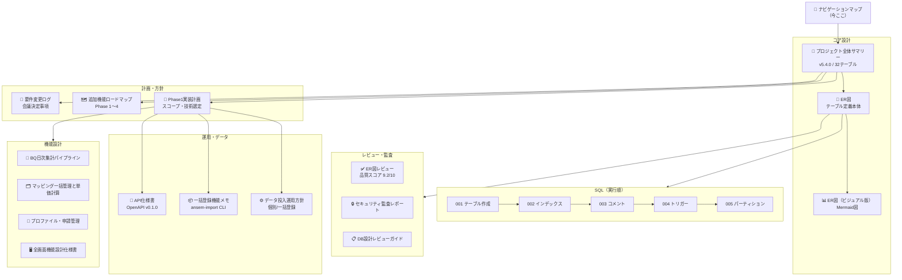

# ANSEM 設計ナビゲーションマップ

> チームメンバーが「どこから読めばいいか」迷わないためのガイド。

## 読む順番

### 初めてプロジェクトに参加する人

```
1. 本ドキュメント（今ここ）
2. [[ANSEM-プロジェクト全体サマリー]]     ← 全体像をつかむ
3. [[ANSEM-ER図]]                        ← DB設計の詳細
4. [[ANSEM-データ投入運用方針]]            ← 運用ルールを知る
```

### 開発に入る人

```
1. [[ANSEM-Phase1実装計画]]              ← スコープと技術選定
2. [[ANSEM-API仕様書.yaml]]              ← エンドポイント定義
3. sql/ フォルダの DDL（001〜005）         ← 実際のテーブル定義
4. 機能設計/ フォルダの該当機能            ← 担当機能の詳細
```

### 企画・マネジメント向け

```
1. [[ANSEM-プロジェクト全体サマリー]]
2. [[ANSEM-追加機能ロードマップ]]         ← Phase 1〜4 の全体計画
3. [[ANSEM-要件変更ログ]]                ← 決定事項の経緯
```

## ドキュメント関係図



## 全ドキュメント一覧

### コア設計

| ドキュメント | 内容 | 対象者 |
|-------------|------|--------|
| [[ANSEM-プロジェクト全体サマリー]] | 背景・課題・32テーブル構成・設計基本ルール | 全員 |
| [[ANSEM-ER図]] | DB設計本体（v5.4.0）。全テーブル・カラム・FK制約 | 設計者・開発者 |
| [[ANSEM-ER図（ビジュアル版）]] | Mermaid記法によるリレーション可視化 | 全員 |

### 計画・方針

| ドキュメント | 内容 | 対象者 |
|-------------|------|--------|
| [[ANSEM-Phase1実装計画]] | Phase 1 スコープ、技術スタック、ディレクトリ構成 | 開発チーム |
| [[ANSEM-追加機能ロードマップ]] | Phase 1〜4 の機能計画・優先度 | PM・経営層 |
| [[ANSEM-要件変更ログ]] | 会議での決定事項・当初要件からの変更追跡 | PM・設計者 |

### 運用・データ

| ドキュメント | 内容 | 対象者 |
|-------------|------|--------|
| [[ANSEM-データ投入運用方針]] | 個別/一括登録の2方式、品質保証ルール | 運用・管理部 |
| [[ANSEM-一括登録機能メモ]] | ansem-import CLI の設計・バリデーション仕様 | 開発者 |
| [[ANSEM-API仕様書.yaml]] | REST API エンドポイント定義（OpenAPI） | バックエンド |

### 機能設計

| ドキュメント | 内容 | 対象者 |
|-------------|------|--------|
| [[機能設計書：BQ日次集計パイプライン]] | BQ → CloudSQL の日次集計。コスト設計含む | インフラ・バックエンド |
| [[機能設計書：マッピング一括管理と単価計算エンジン]] | 単価管理UI・計算ロジック | フルスタック |
| [[機能設計書：インフルエンサープロファイル・申請管理編]] | プロフィール完成度・申請フロー | フロント・バックエンド |
| [[全画面機能設計仕様書（BackOffice App）]] | BackOffice 全画面の構成・フロー | UI/UX・フロント |

### レビュー・監査

| ドキュメント | 内容 | 対象者 |
|-------------|------|--------|
| [[ANSEM-ER図レビュー]] | 設計レビュー v1.0〜v5.1（23件全対応済み） | 設計者 |
| [[ANSEM-セキュリティ監査レポート]] | セキュリティ観点のレビュー結果 | セキュリティ・リード |
| [[ANSEM-DB設計レビューガイド]] | レビューのやり方・チェックリスト | レビュアー |

### SQL（実行順）

| ファイル | 内容 |
|---------|------|
| `sql/001_create_tables.sql` | 32テーブル + FK制約 |
| `sql/002_create_indexes.sql` | 複合・部分・GINインデックス |
| `sql/003_create_comments.sql` | テーブル・カラムコメント |
| `sql/004_create_triggers.sql` | updated_at 自動更新 |
| `sql/005_create_partitions.sql` | 年次/月次パーティション |

### その他

| ドキュメント | 内容 |
|-------------|------|
| [[ANSEM-NotebookLM用フィード]] | AI分析・ポッドキャスト生成用の統合資料 |

## 更新ルール

- 設計変更時は **ER図 → 全体サマリー → 該当機能設計書** の順に更新
- 要件変更は必ず **要件変更ログ** に記録してから設計に反映
- 本マップは新ドキュメント追加時に更新すること

---

_作成日: 2026-02-20_
_最終更新: 2026-02-20_
