# インフルエンサー管理システム ER図

## 📊 概要

このER図は、インフルエンサー・広告配信管理システムのデータベース構造を表現しています。

**4つの主要領域**:
1. 社内組織 (Internal)
2. インフルエンサー (Influencer Domain)
3. パートナー・広告主 (Business)
4. 広告配信・成果 (Ad Delivery & Performance)

**リレーション表記**:
- **実線**: 物理的な外部キー制約（システムで強制される繋がり）
- **点線**: 論理的な繋がり（IDは持っているが、FK制約がないもの）

---

## 🗺️ ER図

```mermaid
erDiagram
    %% ==========================================
    %% 1. 社内組織 (Internal)
    %% ==========================================

    t_departments {
        BIGINT department_id PK
        BIGINT parent_department_id FK "自己参照"
        TEXT department_name
        TEXT department_code
        BOOLEAN is_active
    }

    t_agents {
        BIGINT agent_id PK
        BIGINT department_id FK
        TEXT agent_name
        TEXT email_address
        TEXT login_id
        SMALLINT status_id "1:現役,2:退任,3:休職"
        DATE join_date
    }

    t_agent_security {
        BIGINT agent_id PK,FK
        TEXT password_hash
        TEXT password_salt
        TIMESTAMPTZ last_login_at
        SMALLINT login_failure_count
    }

    t_agent_logs {
        BIGINT log_id PK
        BIGINT agent_id FK
        TEXT action_type
        TIMESTAMPTZ created_at
    }

    %% リレーション
    t_departments ||--o{ t_departments : "階層構造"
    t_departments ||--o{ t_agents : "所属"
    t_agents ||--|| t_agent_security : "1:1 認証"
    t_agents ||--o{ t_agent_logs : "履歴"

    %% ==========================================
    %% 2. インフルエンサー (Influencer Domain)
    %% ==========================================

    t_influencers {
        BIGINT influencer_id PK
        TEXT influencer_name
        TEXT influencer_alias
        TEXT login_id
        SMALLINT status_id "仮登録→本登録"
        BOOLEAN compliance_check
        SMALLINT billing_type_id "請求書区分"
        TEXT invoice_tax_id "適格請求書番号"
        TEXT affiliation_name "事務所名"
        SMALLINT affiliation_type_id
        TEXT account_number "口座情報"
    }

    t_influencer_security {
        BIGINT influencer_id PK,FK
        TEXT password_hash
        TEXT password_salt
        TIMESTAMPTZ last_login_at
    }

    t_sns_accounts {
        BIGINT influencer_id PK,FK
        TEXT instagram_url
        TEXT tiktok_url
        TEXT youtube_url
        TEXT x_url
    }

    t_addresses {
        BIGINT address_id PK
        BIGINT influencer_id FK
        TEXT zip_code
        TEXT address_line1
        TEXT address_line2
        BOOLEAN is_primary
    }

    t_influencer_logs {
        BIGINT log_id PK
        BIGINT influencer_id FK
        TEXT action_type
        TIMESTAMPTZ created_at
    }

    t_influencer_agent_assignments {
        BIGINT assignment_id PK
        BIGINT influencer_id FK
        BIGINT agent_id FK
        SMALLINT role_type "メイン/サブ/スカウト"
        TIMESTAMPTZ assigned_at
        TIMESTAMPTZ unassigned_at
        BOOLEAN is_active
    }

    %% リレーション
    t_influencers ||--|| t_influencer_security : "1:1 認証"
    t_influencers ||--|| t_sns_accounts : "1:1 SNS"
    t_influencers ||--o{ t_addresses : "複数住所"
    t_influencers ||--o{ t_influencer_logs : "履歴"
    t_influencers ||--o{ t_influencer_agent_assignments : "割当"
    t_agents ||--o{ t_influencer_agent_assignments : "担当"

    %% ==========================================
    %% 3. パートナー・広告主 (Business)
    %% ==========================================

    t_partners {
        BIGINT partner_id PK
        BIGINT influencer_id FK "Nullable"
        TEXT partner_name
        TEXT email_address
        TEXT login_id
        SMALLINT status_id
    }

    t_partner_sites {
        BIGINT site_id PK
        BIGINT partner_id FK
        TEXT site_name
        SMALLINT status_id "1:稼働中,2:審査中,3:一時停止,9:停止"
    }

    t_clients {
        BIGINT client_id PK
        TEXT client_name
        TEXT industry "業界・ジャンル"
        SMALLINT status_id
    }

    %% リレーション
    t_influencers |o--o{ t_partners : "連携(任意)"
    t_partners ||--o{ t_partner_sites : "運営"

    %% ==========================================
    %% 4. 広告配信 (Ad Delivery)
    %% ==========================================

    t_ad_groups {
        BIGINT ad_group_id PK
        TEXT ad_group_name "グループ名(案件名)"
    }

    t_ad_contents {
        BIGINT ad_content_id PK
        BIGINT ad_group_id FK
        BIGINT client_id "No FK"
        BIGINT person_id "No FK(Influencer)"
        TEXT ad_name
        TIMESTAMPTZ delivery_start_at
        TIMESTAMPTZ delivery_end_at
        SMALLINT delivery_status
    }

    t_unit_prices {
        BIGINT id PK
        BIGINT site_id FK
        DECIMAL unit_price
        DECIMAL limit_cap "上限金額"
        DECIMAL semi_unit_price "セミ単価"
        TIMESTAMPTZ start_at
        TIMESTAMPTZ end_at
        SMALLINT status_id
    }

    t_campaigns {
        BIGINT id PK
        BIGINT site_id FK
        SMALLINT platform_type "1:YouTube, 2:Instagram"
        SMALLINT reward_type "1:固定/CPA, 2:成果/CPC"
        SMALLINT price_type "1:Gross, 2:Net"
        SMALLINT status_id
        TIMESTAMPTZ created_at
        TIMESTAMPTZ updated_at
    }

    %% リレーション
    t_ad_groups ||--o{ t_ad_contents : "内包(FKあり)"
    t_partner_sites ||--o{ t_unit_prices : "単価設定"
    t_partner_sites ||--o{ t_campaigns : "キャンペーン設定"

    %% 論理リレーション(点線) - FK制約なし
    t_clients |o..o{ t_ad_contents : "論理紐付(client_id)"
    t_influencers |o..o{ t_ad_contents : "出演(person_id)"

    %% ==========================================
    %% 5. 成果・集計 (Performance)
    %% ==========================================

    t_daily_performance_details {
        DATE action_date PK "Partition Key"
        BIGINT partner_id PK,FK
        BIGINT site_id PK
        BIGINT client_id PK
        BIGINT content_id PK
        SMALLINT status_id PK "1:未承認,2:承認,9:否認"
        TEXT partner_name "スナップショット"
        TEXT site_name "スナップショット"
        TEXT client_name "スナップショット"
        TEXT content_name "スナップショット"
        INTEGER cv_count
        DECIMAL client_action_cost "報酬総額"
        DECIMAL unit_price "平均単価"
        TIMESTAMPTZ updated_at
    }

    t_daily_click_details {
        DATE action_date PK "Partition Key"
        BIGINT site_id PK
        TEXT site_name "スナップショット"
        INTEGER click_count
        TIMESTAMPTZ updated_at
    }

    %% リレーション
    t_partners ||--o{ t_daily_performance_details : "集計"
    t_partner_sites ||--o{ t_daily_performance_details : "集計"
    t_clients ||--o{ t_daily_performance_details : "集計"
    t_ad_contents ||--o{ t_daily_performance_details : "集計"

    t_partner_sites ||--o{ t_daily_click_details : "クリック集計"
```



---

## 📋 テーブル一覧

### 1. 社内組織 (Internal)
| テーブル名 | 説明 |
|-----------|------|
| **t_departments** | 部署マスタ（階層構造対応） |
| **t_agents** | エージェント（担当者）マスタ |
| **t_agent_security** | エージェント認証情報（1:1） |
| **t_agent_logs** | エージェント操作履歴 |

### 2. インフルエンサー (Influencer Domain)
| テーブル名 | 説明 |
|-----------|------|
| **t_influencers** | インフルエンサーマスタ |
| **t_influencer_security** | 認証情報（1:1） |
| **t_sns_accounts** | SNSアカウント（1:1） |
| **t_addresses** | 住所情報（1:多） |
| **t_influencer_logs** | 操作履歴 |
| **t_influencer_agent_assignments** | 担当者割当（履歴管理） |

### 3. パートナー・広告主 (Business)
| テーブル名 | 説明 |
|-----------|------|
| **t_partners** | パートナー（ASP）マスタ |
| **t_partner_sites** | サイト（媒体）マスタ |
| **t_clients** | クライアント（広告主）マスタ |

### 4. 広告配信 (Ad Delivery)
| テーブル名 | 説明 |
|-----------|------|
| **t_ad_groups** | 広告グループ（案件単位） |
| **t_ad_contents** | 広告コンテンツ（クリエイティブ） |
| **t_unit_prices** | 単価マスタ（期間・上限管理） |
| **t_campaigns** | キャンペーン設定（媒体・報酬体系） |

### 5. 成果・集計 (Performance)
| テーブル名 | 説明 |
|-----------|------|
| **t_daily_performance_details** | 日次CV成果（パーティション） |
| **t_daily_click_details** | 日次クリック数（パーティション） |

---

## 🔍 設計の特徴

### ✅ 良い設計ポイント

#### 1. サイトごとのパラメーター管理
```
t_campaigns {
    site_id FK
    platform_type    -- YouTube/Instagram
    reward_type      -- 固定/成果報酬
    price_type       -- Gross/Net
}
```
各サイト（媒体）ごとに媒体タイプ、報酬体系、価格区分を柔軟に設定可能。

#### 2. セキュリティ分離
```
インフルエンサー ←1:1→ 認証テーブル
エージェント ←1:1→ 認証テーブル
```
認証情報を別テーブルに分離し、パスワード漏洩リスクを低減。

#### 3. パーティショニング
```sql
t_daily_performance_details (action_date で分割)
t_daily_click_details (action_date で分割)
```
大量データの効率的な検索・集計が可能。

#### 4. スナップショット方式
```sql
t_daily_performance_details {
    partner_name TEXT  -- マスタの名前を保存
    site_name TEXT
    client_name TEXT
    content_name TEXT
}
```
過去の集計データで名前が変わっても、当時の名前を保持。

#### 5. 履歴管理
```sql
t_influencer_agent_assignments {
    assigned_at    -- 開始日
    unassigned_at  -- 終了日
    is_active      -- 現在担当中フラグ
}

t_unit_prices {
    start_at  -- 適用開始
    end_at    -- 適用終了
}
```
担当者変更や単価変更の履歴を完全追跡。

#### 6. 柔軟な組織階層
```sql
t_departments {
    parent_department_id  -- 自己参照FK
}
```
任意の深さの組織構造に対応。

### ⚠️ 改善検討ポイント

#### 1. FK制約のない論理リレーション
```sql
t_ad_contents {
    client_id BIGINT  -- "No FK"
    person_id BIGINT  -- "No FK (Influencer)"
}
```

**問題**:
- データ整合性がアプリ側依存
- 存在しないIDが入る可能性

**推奨**:
```sql
ALTER TABLE t_ad_contents
    ADD CONSTRAINT fk_content_client
    FOREIGN KEY (client_id) REFERENCES t_clients(client_id);

ALTER TABLE t_ad_contents
    ADD CONSTRAINT fk_content_person
    FOREIGN KEY (person_id) REFERENCES t_influencers(influencer_id);
```

#### 2. パートナーとサイトの関係
```
t_partners (パートナー)
  └─ t_partner_sites (サイト)
       └─ なぜsite_idに複数のCV?
```

**不明点**:
- 1サイト = 1媒体（InstagramアカウントやYouTubeチャンネル）？
- それとも1サイト = 複数の投稿枠？

**推奨**:
```sql
-- ASPアカウント
t_asp_accounts {
    asp_account_id PK
    influencer_id FK
    asp_provider "A8/バリューコマース"
}

-- 媒体（SNSアカウント×ASP）
t_media {
    media_id PK
    influencer_id FK
    sns_type "Instagram/YouTube"
    asp_account_id FK
}
```

#### 3. 複合主キーの粒度
```sql
t_daily_performance_details {
    -- PK: (action_date, partner_id, site_id,
    --      client_id, content_id, status_id)
}
```

**問題**:
- 同じ日・同じ組み合わせで複数のCVが発生したら？
- status_idがPKに含まれる → Pending→Approvedの更新が別レコード

**推奨**:
```sql
t_daily_performance_details {
    id BIGINT PK                    -- サロゲートキー
    action_date DATE NOT NULL
    partner_id BIGINT NOT NULL
    site_id BIGINT NOT NULL
    client_id BIGINT NOT NULL
    content_id BIGINT NOT NULL
    status_id SMALLINT NOT NULL
    cv_count INTEGER
    revenue DECIMAL
}

-- 複合インデックス
CREATE INDEX idx_perf_date_partner_status
ON t_daily_performance_details (action_date, partner_id, status_id);
```

#### 4. 監査情報の不足
全てのマスタテーブルに以下を追加推奨:
```sql
created_by BIGINT     -- 作成者（エージェントID）
updated_by BIGINT     -- 更新者（エージェントID）
deleted_at TIMESTAMPTZ -- 論理削除（NULL = 有効）
```

---

## 💡 主要なクエリパターン

### インフルエンサーの月次成果
```sql
SELECT
    i.influencer_name,
    SUM(d.cv_count) as total_cv,
    SUM(d.client_action_cost) as total_revenue,
    AVG(d.unit_price) as avg_unit_price
FROM t_influencers i
JOIN t_partners p ON i.influencer_id = p.influencer_id
JOIN t_daily_performance_details d ON p.partner_id = d.partner_id
WHERE d.action_date BETWEEN '2026-01-01' AND '2026-01-31'
  AND d.status_id = 2  -- 承認済みのみ
GROUP BY i.influencer_id, i.influencer_name
ORDER BY total_revenue DESC;
```

### 担当エージェントの成果集計
```sql
SELECT
    a.agent_name,
    COUNT(DISTINCT i.influencer_id) as influencer_count,
    SUM(d.cv_count) as total_cv,
    SUM(d.client_action_cost) as total_revenue
FROM t_agents a
JOIN t_influencer_agent_assignments ia
  ON a.agent_id = ia.agent_id
  AND ia.is_active = TRUE  -- 現在の担当のみ
JOIN t_influencers i ON ia.influencer_id = i.influencer_id
JOIN t_partners p ON i.influencer_id = p.influencer_id
JOIN t_daily_performance_details d ON p.partner_id = d.partner_id
WHERE d.action_date >= CURRENT_DATE - INTERVAL '30 days'
  AND ia.role_type = 1  -- メイン担当のみ
GROUP BY a.agent_id, a.agent_name
ORDER BY total_revenue DESC;
```

### クライアント別の投資対効果
```sql
SELECT
    c.client_name,
    c.industry,
    COUNT(DISTINCT ac.ad_content_id) as content_count,
    SUM(d.cv_count) as total_cv,
    SUM(d.client_action_cost) as total_cost,
    ROUND(AVG(d.unit_price), 0) as avg_unit_price
FROM t_clients c
JOIN t_daily_performance_details d ON c.client_id = d.client_id
LEFT JOIN t_ad_contents ac ON d.content_id = ac.ad_content_id
WHERE d.action_date >= CURRENT_DATE - INTERVAL '90 days'
  AND d.status_id = 2
GROUP BY c.client_id, c.client_name, c.industry
ORDER BY total_cost DESC;
```

---

## 🎯 総合評価

**スコア: 8.5/10**

### ✅ 優れている点
- サイトごとのパラメーター管理（t_campaigns）
- セキュリティ情報の分離
- パーティショニング戦略
- スナップショット方式
- 履歴管理機能
- 階層構造対応

### ⚠️ 改善推奨
- FK制約の追加（論理リレーションを物理化）
- 複合PKの見直し（サロゲートキー導入）
- 監査情報の追加（created_by, updated_by）
- パートナー/サイトの概念整理

### 🚀 次のステップ
1. ドメインモデルの明確化（特にパートナー/サイト）
2. FK制約の追加検討
3. インデックス戦略の策定
4. サンプルデータでの検証

---

**作成日**: 2026-01-29
**作成者**: guchi
**タグ**: #database #er図 #設計 #インフルエンサー #project #レビュー完了
