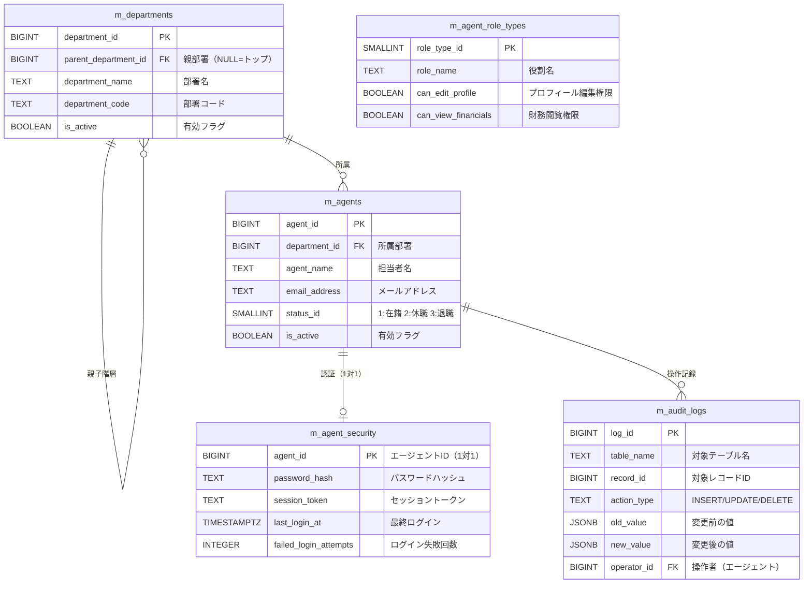
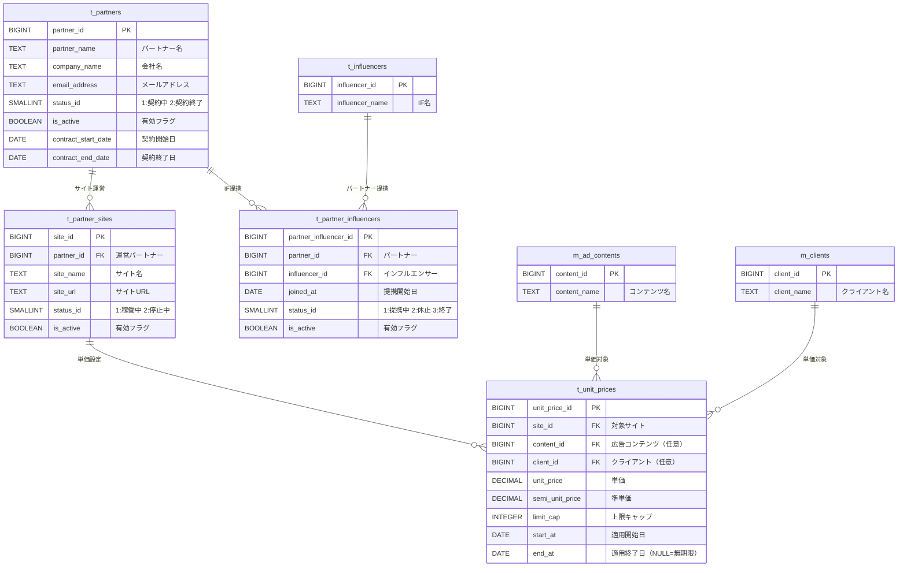
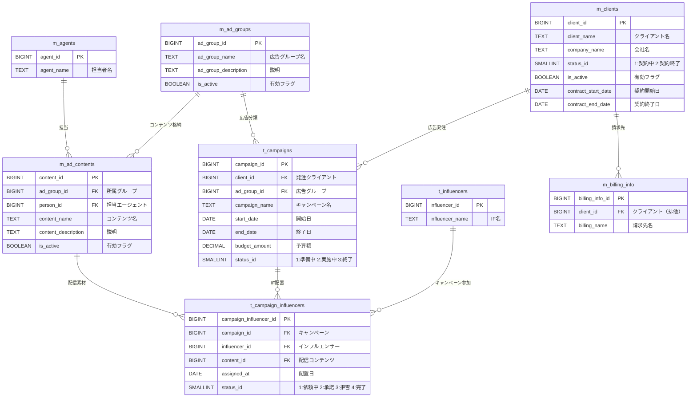
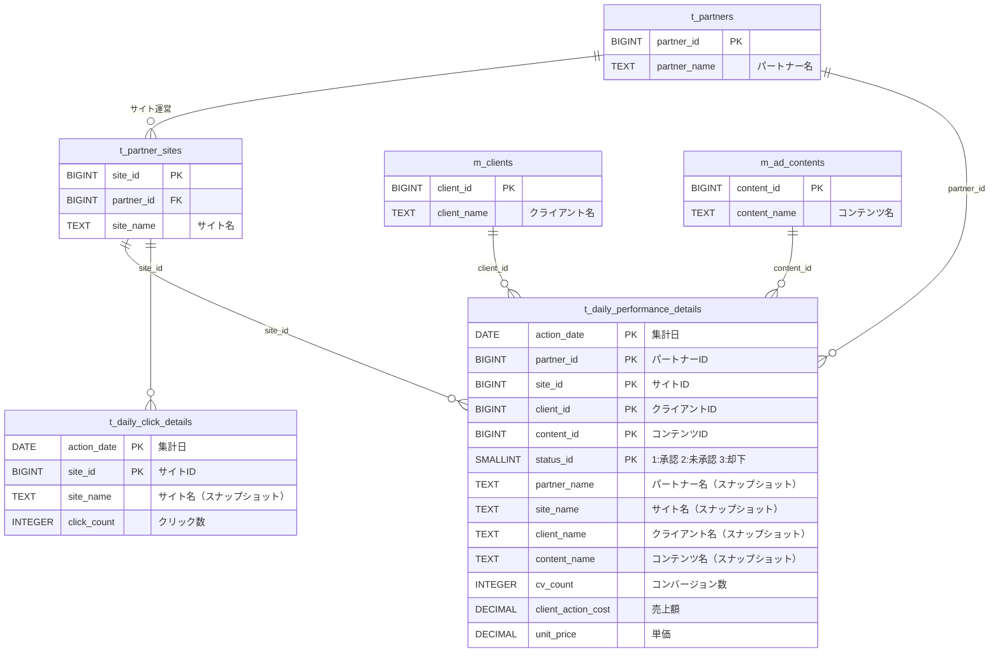
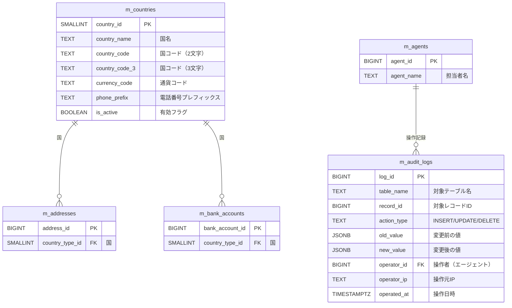

# ANSEM ER図（ビジュアル版）

> [!NOTE]
> この文書は [[ANSEM-ER図]] の27テーブルを、ドメイン別に分割して視覚的にわかりやすくまとめたものです。
> 全カラムではなく、PK・FK・主要業務カラムに絞って記載しています。

---

## 🗺️ 全体俯瞰図

システム全体の主要エンティティと関係性を、カラム詳細なしで俯瞰できる図です。
「どのテーブルがどこと繋がっているか」を一目で把握できます。

```mermaid
erDiagram
    %% === 組織系 ===
    m_departments ||--o{ m_agents : "所属"
    m_agents ||--o| m_agent_security : "認証"
    m_agents ||--o{ m_audit_logs : "操作記録"

    %% === IF系（中心） ===
    t_influencers ||--o| m_influencer_security : "認証"
    t_influencers ||--o{ m_addresses : "住所登録"
    t_influencers ||--o{ m_bank_accounts : "口座登録"
    t_influencers ||--o{ m_billing_info : "請求先"
    t_influencers ||--o{ m_influencer_sns_accounts : "SNS運営"
    t_influencers ||--o{ m_influencer_agent_assignments : "担当割当"
    t_influencers ||--o{ t_campaign_influencers : "キャンペーン参加"
    t_influencers ||--o{ t_partner_influencers : "パートナー提携"

    %% === 担当割当の参照先 ===
    m_agents ||--o{ m_influencer_agent_assignments : "担当"
    m_agent_role_types ||--o{ m_influencer_agent_assignments : "役割定義"

    %% === SNS・カテゴリ系 ===
    m_sns_platforms ||--o{ m_influencer_sns_accounts : "プラットフォーム"
    m_influencer_sns_accounts ||--o{ m_account_categories : "ジャンル分類"
    m_categories ||--o{ m_account_categories : "カテゴリ"

    %% === 国マスタ ===
    m_countries ||--o{ m_addresses : "国"
    m_countries ||--o{ m_bank_accounts : "国"

    %% === パートナー系 ===
    t_partners ||--o{ t_partner_sites : "サイト運営"
    t_partners ||--o{ t_partner_influencers : "IF提携"
    t_partner_sites ||--o{ t_unit_prices : "単価設定"

    %% === キャンペーン・広告系 ===
    m_clients ||--o{ t_campaigns : "広告発注"
    m_clients ||--o{ m_billing_info : "請求先"
    m_clients ||--o{ t_unit_prices : "単価"
    m_ad_groups ||--o{ m_ad_contents : "コンテンツ格納"
    m_ad_groups ||--o{ t_campaigns : "広告分類"
    m_ad_contents ||--o{ t_campaign_influencers : "配信素材"
    m_ad_contents ||--o{ t_unit_prices : "単価対象"
    m_agents ||--o{ m_ad_contents : "担当"
    t_campaigns ||--o{ t_campaign_influencers : "IF配置"

    %% === 集計系（FK制約あり・スナップショット方式） ===
    t_partners ||--o{ t_daily_performance_details : "CV集計"
    t_partner_sites ||--o{ t_daily_performance_details : "CV集計"
    t_partner_sites ||--o{ t_daily_click_details : "クリック集計"
    m_clients ||--o{ t_daily_performance_details : "CV集計"
    m_ad_contents ||--o{ t_daily_performance_details : "CV集計"
```



---

## 🔍 全体詳細図

全27テーブルのカラム定義とリレーションを1枚にまとめた詳細版です。
PK・FK・主要業務カラムを記載しています（監査カラム4つは全テーブル共通のため省略）。

> [!TIP]
> オブのプレビューモード（`Cmd + E`）で表示してください。テーブル数が多いため、表示に数秒かかる場合があります。

```mermaid
erDiagram
    %% ============================================================
    %% 🌏 共通系マスタ
    %% ============================================================

    m_countries {
        SMALLINT country_id PK
        TEXT country_name "国名"
        TEXT country_code "2文字コード"
        TEXT country_code_3 "3文字コード"
        TEXT currency_code "通貨コード"
        TEXT phone_prefix "電話プレフィックス"
        BOOLEAN is_active "有効フラグ"
        INTEGER display_order "表示順"
    }

    m_categories {
        BIGINT category_id PK
        BIGINT parent_category_id FK "親カテゴリ（NULL=大）"
        TEXT category_name "カテゴリ名"
        TEXT category_code "カテゴリコード"
        TEXT category_description "説明"
        BOOLEAN is_active "有効フラグ"
        INTEGER display_order "表示順"
    }

    %% ============================================================
    %% 🏢 組織・エージェント系
    %% ============================================================

    m_departments {
        BIGINT department_id PK
        BIGINT parent_department_id FK "親部署（NULL=トップ）"
        TEXT department_name "部署名"
        TEXT department_code "部署コード"
        BOOLEAN is_active "有効フラグ"
        INTEGER display_order "表示順"
    }

    m_agents {
        BIGINT agent_id PK
        BIGINT department_id FK "所属部署"
        TEXT agent_name "担当者名"
        TEXT email_address "メールアドレス"
        TEXT phone_number "電話番号"
        SMALLINT status_id "1:在籍 2:休職 3:退職"
        BOOLEAN is_active "有効フラグ"
        DATE hired_at "入社日"
    }

    m_agent_role_types {
        SMALLINT role_type_id PK
        TEXT role_name "役割名"
        TEXT role_description "説明"
        BOOLEAN can_edit_profile "プロフィール編集権限"
        BOOLEAN can_view_financials "財務閲覧権限"
        BOOLEAN is_active "有効フラグ"
        INTEGER display_order "表示順"
    }

    m_agent_security {
        BIGINT agent_id PK_FK "エージェントID（1対1）"
        TEXT password_hash "パスワードハッシュ"
        TEXT password_salt "ソルト"
        TEXT session_token "セッショントークン"
        TIMESTAMPTZ session_expires_at "セッション有効期限"
        TIMESTAMPTZ last_login_at "最終ログイン"
        TEXT last_login_ip "最終ログインIP"
        TIMESTAMPTZ password_changed_at "パスワード変更日時"
        INTEGER failed_login_attempts "ログイン失敗回数"
        TIMESTAMPTZ locked_until "ロック解除日時"
    }

    m_audit_logs {
        BIGINT log_id PK
        TEXT table_name "対象テーブル名"
        BIGINT record_id "対象レコードID"
        TEXT action_type "INSERT/UPDATE/DELETE"
        JSONB old_value "変更前の値"
        JSONB new_value "変更後の値"
        BIGINT operator_id FK "操作者エージェント"
        TEXT operator_ip "操作元IP"
        TIMESTAMPTZ operated_at "操作日時"
    }

    %% ============================================================
    %% 👤 インフルエンサー系
    %% ============================================================

    t_influencers {
        BIGINT influencer_id PK
        TEXT influencer_name "IF名"
        TEXT email_address "メールアドレス"
        TEXT phone_number "電話番号"
        DATE date_of_birth "生年月日"
        SMALLINT gender_id "1:男 2:女 3:他 9:未回答"
        SMALLINT status_id "1:契約中 2:休止 3:終了"
        BOOLEAN is_active "有効フラグ"
        DATE joined_at "登録日"
        TEXT notes "備考"
    }

    m_influencer_security {
        BIGINT influencer_id PK_FK "IF ID（1対1）"
        TEXT password_hash "パスワードハッシュ"
        TEXT password_salt "ソルト"
        TEXT session_token "セッショントークン"
        TIMESTAMPTZ session_expires_at "セッション有効期限"
        TIMESTAMPTZ last_login_at "最終ログイン"
        TEXT last_login_ip "最終ログインIP"
        INTEGER failed_login_attempts "ログイン失敗回数"
        TIMESTAMPTZ locked_until "ロック解除日時"
        TEXT password_reset_token "リセットトークン"
        TIMESTAMPTZ reset_token_expires_at "リセット有効期限"
    }

    m_addresses {
        BIGINT address_id PK
        BIGINT influencer_id FK "所有IF"
        SMALLINT address_type_id "1:請求先 2:送付先"
        SMALLINT country_type_id FK "国"
        TEXT recipient_name "宛名"
        TEXT zip_code "郵便番号"
        TEXT state_province "都道府県"
        TEXT city "市区町村"
        TEXT address_line1 "住所1"
        TEXT address_line2 "住所2"
        TEXT phone_number "電話番号"
        BOOLEAN is_primary "メイン住所フラグ"
        BOOLEAN is_active "有効フラグ"
    }

    m_bank_accounts {
        BIGINT bank_account_id PK
        BIGINT influencer_id FK "所有IF"
        SMALLINT country_type_id FK "国"
        TEXT bank_name "銀行名"
        TEXT branch_name "支店名"
        SMALLINT account_type_id "1:普通 2:当座 3:貯蓄"
        TEXT account_number "口座番号"
        TEXT account_holder_name "口座名義"
        TEXT swift_code "SWIFTコード"
        TEXT iban "IBAN"
        BOOLEAN is_primary "メイン口座フラグ"
        BOOLEAN is_active "有効フラグ"
    }

    m_billing_info {
        BIGINT billing_info_id PK
        BIGINT influencer_id FK "IF（排他）"
        BIGINT client_id FK "クライアント（排他）"
        SMALLINT billing_type_id "1:個人 2:法人"
        BIGINT billing_address_id FK "請求先住所"
        TEXT billing_name "請求先名"
        TEXT invoice_recipient_email "請求書送付先"
        TEXT invoice_tax_id "税務番号"
        INTEGER payment_terms_days "支払期日（日数）"
        BOOLEAN is_active "有効フラグ"
    }

    %% ============================================================
    %% 📱 SNS・カテゴリ系
    %% ============================================================

    m_sns_platforms {
        BIGINT platform_id PK
        TEXT platform_name "プラットフォーム名"
        TEXT platform_code "コード"
        TEXT url_pattern "URLパターン"
        BOOLEAN is_active "有効フラグ"
        INTEGER display_order "表示順"
    }

    m_influencer_sns_accounts {
        BIGINT account_id PK
        BIGINT influencer_id FK "所有IF"
        BIGINT platform_id FK "SNSプラットフォーム"
        TEXT account_url "アカウントURL"
        TEXT account_handle "ハンドル名"
        BIGINT follower_count "フォロワー数"
        DECIMAL engagement_rate "エンゲージメント率"
        BOOLEAN is_primary "メインアカウントフラグ"
        BOOLEAN is_verified "認証済フラグ"
        SMALLINT status_id "1:有効 2:停止 3:削除"
        TIMESTAMPTZ last_updated_at "最終更新日時"
    }

    m_account_categories {
        BIGINT account_category_id PK
        BIGINT account_id FK "SNSアカウント"
        BIGINT category_id FK "カテゴリ"
        BOOLEAN is_primary "メインカテゴリフラグ"
    }

    m_influencer_agent_assignments {
        BIGINT assignment_id PK
        BIGINT influencer_id FK "担当IF"
        BIGINT agent_id FK "担当エージェント"
        SMALLINT role_type_id FK "役割タイプ"
        DATE assigned_at "割当日"
        DATE unassigned_at "解除日"
        BOOLEAN is_active "有効フラグ"
    }

    %% ============================================================
    %% 📢 広告・クライアント系
    %% ============================================================

    m_clients {
        BIGINT client_id PK
        TEXT client_name "クライアント名"
        TEXT company_name "会社名"
        TEXT email_address "メールアドレス"
        TEXT phone_number "電話番号"
        SMALLINT status_id "1:契約中 2:契約終了"
        BOOLEAN is_active "有効フラグ"
        DATE contract_start_date "契約開始日"
        DATE contract_end_date "契約終了日"
    }

    m_ad_groups {
        BIGINT ad_group_id PK
        TEXT ad_group_name "広告グループ名"
        TEXT ad_group_description "説明"
        BOOLEAN is_active "有効フラグ"
        INTEGER display_order "表示順"
    }

    m_ad_contents {
        BIGINT content_id PK
        BIGINT ad_group_id FK "所属グループ"
        BIGINT person_id FK "担当エージェント"
        TEXT content_name "コンテンツ名"
        TEXT content_description "説明"
        BOOLEAN is_active "有効フラグ"
        INTEGER display_order "表示順"
    }

    %% ============================================================
    %% 🤝 パートナー系
    %% ============================================================

    t_partners {
        BIGINT partner_id PK
        TEXT partner_name "パートナー名"
        TEXT company_name "会社名"
        TEXT email_address "メールアドレス"
        TEXT phone_number "電話番号"
        SMALLINT status_id "1:契約中 2:契約終了"
        BOOLEAN is_active "有効フラグ"
        DATE contract_start_date "契約開始日"
        DATE contract_end_date "契約終了日"
    }

    t_partner_sites {
        BIGINT site_id PK
        BIGINT partner_id FK "運営パートナー"
        TEXT site_name "サイト名"
        TEXT site_url "サイトURL"
        SMALLINT status_id "1:稼働中 2:停止中"
        BOOLEAN is_active "有効フラグ"
    }

    t_partner_influencers {
        BIGINT partner_influencer_id PK
        BIGINT partner_id FK "パートナー"
        BIGINT influencer_id FK "インフルエンサー"
        DATE joined_at "提携開始日"
        SMALLINT status_id "1:提携中 2:休止 3:終了"
        BOOLEAN is_active "有効フラグ"
    }

    %% ============================================================
    %% 📊 キャンペーン系
    %% ============================================================

    t_campaigns {
        BIGINT campaign_id PK
        BIGINT client_id FK "発注クライアント"
        BIGINT ad_group_id FK "広告グループ"
        TEXT campaign_name "キャンペーン名"
        TEXT campaign_description "説明"
        DATE start_date "開始日"
        DATE end_date "終了日"
        DECIMAL budget_amount "予算額"
        SMALLINT status_id "1:準備中 2:実施中 3:終了"
        BOOLEAN is_active "有効フラグ"
    }

    t_campaign_influencers {
        BIGINT campaign_influencer_id PK
        BIGINT campaign_id FK "キャンペーン"
        BIGINT influencer_id FK "インフルエンサー"
        BIGINT content_id FK "配信コンテンツ"
        DATE assigned_at "配置日"
        SMALLINT status_id "1:依頼中 2:承諾 3:拒否 4:完了"
    }

    %% ============================================================
    %% 💰 単価設定
    %% ============================================================

    t_unit_prices {
        BIGINT unit_price_id PK
        BIGINT site_id FK "対象サイト"
        BIGINT content_id FK "広告コンテンツ"
        BIGINT client_id FK "クライアント"
        DECIMAL unit_price "単価"
        DECIMAL semi_unit_price "準単価"
        INTEGER limit_cap "上限キャップ"
        DATE start_at "適用開始日"
        DATE end_at "適用終了日（NULL=無期限）"
        BOOLEAN is_active "有効フラグ"
    }

    %% ============================================================
    %% 📈 集計系（FK制約あり・スナップショット方式）
    %% ============================================================

    t_daily_performance_details {
        DATE action_date PK "集計日"
        BIGINT partner_id PK_FK "パートナー"
        BIGINT site_id PK_FK "サイト（NULL=未設定）"
        BIGINT client_id PK_FK "クライアント"
        BIGINT content_id PK_FK "コンテンツ（NULL=未設定）"
        SMALLINT status_id PK "1:承認 2:未承認 9:キャンセル"
        TEXT partner_name "パートナー名（SS）"
        TEXT site_name "サイト名（SS）"
        TEXT client_name "クライアント名（SS）"
        TEXT content_name "コンテンツ名（SS）"
        INTEGER cv_count "CV件数"
        DECIMAL client_action_cost "報酬総額"
        DECIMAL unit_price "平均単価"
    }

    t_daily_click_details {
        DATE action_date PK "集計日"
        BIGINT site_id PK_FK "サイト（NULL=未設定）"
        TEXT site_name "サイト名（SS）"
        INTEGER click_count "クリック件数"
    }

    %% ============================================================
    %% リレーション定義
    %% ============================================================

    %% 共通系
    m_countries ||--o{ m_addresses : "country_type_id"
    m_countries ||--o{ m_bank_accounts : "country_type_id"
    m_categories ||--o{ m_categories : "親子階層"
    m_categories ||--o{ m_account_categories : "category_id"

    %% 組織・エージェント系
    m_departments ||--o{ m_departments : "親子階層"
    m_departments ||--o{ m_agents : "所属"
    m_agents ||--o| m_agent_security : "認証（1対1）"
    m_agents ||--o{ m_audit_logs : "操作記録"
    m_agents ||--o{ m_influencer_agent_assignments : "担当"
    m_agents ||--o{ m_ad_contents : "担当"

    %% IF系
    t_influencers ||--o| m_influencer_security : "認証（1対1）"
    t_influencers ||--o{ m_addresses : "住所登録"
    t_influencers ||--o{ m_bank_accounts : "口座登録"
    t_influencers ||--o{ m_billing_info : "請求先"
    t_influencers ||--o{ m_influencer_sns_accounts : "SNS運営"
    t_influencers ||--o{ m_influencer_agent_assignments : "担当割当"
    t_influencers ||--o{ t_campaign_influencers : "キャンペーン参加"
    t_influencers ||--o{ t_partner_influencers : "パートナー提携"

    %% 担当割当
    m_agent_role_types ||--o{ m_influencer_agent_assignments : "役割定義"

    %% SNS・カテゴリ系
    m_sns_platforms ||--o{ m_influencer_sns_accounts : "プラットフォーム"
    m_influencer_sns_accounts ||--o{ m_account_categories : "ジャンル分類"

    %% パートナー系
    t_partners ||--o{ t_partner_sites : "サイト運営"
    t_partners ||--o{ t_partner_influencers : "IF提携"
    t_partner_sites ||--o{ t_unit_prices : "単価設定"

    %% 広告・クライアント系
    m_clients ||--o{ t_campaigns : "広告発注"
    m_clients ||--o{ m_billing_info : "請求先"
    m_clients ||--o{ t_unit_prices : "単価"
    m_ad_groups ||--o{ m_ad_contents : "コンテンツ格納"
    m_ad_groups ||--o{ t_campaigns : "広告分類"
    m_ad_contents ||--o{ t_campaign_influencers : "配信素材"
    m_ad_contents ||--o{ t_unit_prices : "単価対象"

    %% キャンペーン系
    t_campaigns ||--o{ t_campaign_influencers : "IF配置"

    %% 集計系（FK制約あり）
    t_partners ||--o{ t_daily_performance_details : "CV集計"
    t_partner_sites ||--o{ t_daily_performance_details : "CV集計"
    t_partner_sites ||--o{ t_daily_click_details : "クリック集計"
    m_clients ||--o{ t_daily_performance_details : "CV集計"
    m_ad_contents ||--o{ t_daily_performance_details : "CV集計"
```

> [!NOTE]
> - **SS** = スナップショット（集計時点の名称を保持）
> - 監査カラム（`created_by`, `updated_by`, `created_at`, `updated_at`）は全テーブル共通のため省略
> - `m_categories`, `m_departments` は自己参照（親子階層）

---

### テーブル配置の読み方

| ドメイン | 主要テーブル | 概要 |
|---------|------------|------|
| 組織・エージェント | `m_departments`, `m_agents` | 社内組織と担当者 |
| インフルエンサー | `t_influencers` を中心に8テーブル | IFのプロフィール・認証・SNS・住所・口座 |
| パートナー・サイト | `t_partners`, `t_partner_sites` | ASPパートナーとそのサイト |
| キャンペーン・広告 | `t_campaigns`, `m_ad_groups`, `m_clients` | 広告主・キャンペーン・広告素材 |
| 集計 | `t_daily_performance_details`, `t_daily_click_details` | 日次集計（FK制約あり・スナップショット方式） |
| 共通 | `m_countries`, `m_audit_logs` | 国マスタ・監査ログ |

---

## 🏢 組織・エージェント系

社内の組織構造と担当者（エージェント）を管理するドメインです。
部署は階層構造（事業部 > 部門）を持ち、各エージェントはいずれかの部署に所属します。
エージェントの認証情報は `m_agent_security` で1対1管理されています。

> [!IMPORTANT]
> `m_agents` と `m_agent_role_types` は直接のリレーションを持ちません。
> 役割（メイン担当・サブ担当・スカウト担当）は `m_influencer_agent_assignments` の `role_type_id` を通じて、IF担当割当ごとに設定されます。



---

## 👤 インフルエンサー系

システムの中心的エンティティである `t_influencers` を起点に、個人情報・認証・SNSアカウント・住所・口座・請求先・担当者割当が紐付きます。
SNSアカウントにはカテゴリ（ジャンル）が多対多で関連付けられます。

```mermaid
erDiagram
    t_influencers {
        BIGINT influencer_id PK
        TEXT influencer_name "IF名"
        TEXT email_address "メールアドレス"
        SMALLINT gender_id "1:男 2:女 3:他 9:未回答"
        SMALLINT status_id "1:契約中 2:休止 3:終了"
        BOOLEAN is_active "有効フラグ"
        DATE joined_at "登録日"
    }

    m_influencer_security {
        BIGINT influencer_id PK "IF ID（1対1）"
        TEXT password_hash "パスワードハッシュ"
        TEXT session_token "セッショントークン"
        TIMESTAMPTZ last_login_at "最終ログイン"
        INTEGER failed_login_attempts "ログイン失敗回数"
        TEXT password_reset_token "パスワードリセットトークン"
    }

    m_addresses {
        BIGINT address_id PK
        BIGINT influencer_id FK "所有IF"
        SMALLINT address_type_id "1:請求先 2:送付先"
        SMALLINT country_type_id FK "国"
        TEXT city "市区町村"
        TEXT address_line1 "住所1"
        BOOLEAN is_primary "メイン住所フラグ"
    }

    m_bank_accounts {
        BIGINT bank_account_id PK
        BIGINT influencer_id FK "所有IF"
        SMALLINT country_type_id FK "国"
        TEXT bank_name "銀行名"
        TEXT account_number "口座番号"
        TEXT account_holder_name "口座名義"
        BOOLEAN is_primary "メイン口座フラグ"
    }

    m_billing_info {
        BIGINT billing_info_id PK
        BIGINT influencer_id FK "IF（排他）"
        BIGINT client_id FK "クライアント（排他）"
        SMALLINT billing_type_id "1:個人 2:法人"
        TEXT billing_name "請求先名"
        TEXT invoice_recipient_email "請求書送付先"
    }

    m_influencer_sns_accounts {
        BIGINT account_id PK
        BIGINT influencer_id FK "所有IF"
        BIGINT platform_id FK "SNSプラットフォーム"
        TEXT account_url "アカウントURL"
        TEXT account_handle "ハンドル名"
        BIGINT follower_count "フォロワー数"
        BOOLEAN is_verified "認証済フラグ"
    }

    m_account_categories {
        BIGINT account_category_id PK
        BIGINT account_id FK "SNSアカウント"
        BIGINT category_id FK "カテゴリ"
        BOOLEAN is_primary "メインカテゴリフラグ"
    }

    m_categories {
        BIGINT category_id PK
        BIGINT parent_category_id FK "親カテゴリ"
        TEXT category_name "カテゴリ名"
        TEXT category_code "カテゴリコード"
    }

    m_sns_platforms {
        BIGINT platform_id PK
        TEXT platform_name "プラットフォーム名"
        TEXT platform_code "コード"
        TEXT url_pattern "URLパターン"
    }

    m_influencer_agent_assignments {
        BIGINT assignment_id PK
        BIGINT influencer_id FK "担当IF"
        BIGINT agent_id FK "担当エージェント"
        SMALLINT role_type_id FK "役割タイプ"
        DATE assigned_at "割当日"
        DATE unassigned_at "解除日"
        BOOLEAN is_active "有効フラグ"
    }

    m_countries {
        SMALLINT country_id PK
        TEXT country_name "国名"
        TEXT country_code "国コード"
    }

    t_influencers ||--o| m_influencer_security : "認証（1対1）"
    t_influencers ||--o{ m_addresses : "住所登録"
    t_influencers ||--o{ m_bank_accounts : "口座登録"
    t_influencers ||--o{ m_billing_info : "請求先"
    t_influencers ||--o{ m_influencer_sns_accounts : "SNS運営"
    t_influencers ||--o{ m_influencer_agent_assignments : "担当割当"
    m_sns_platforms ||--o{ m_influencer_sns_accounts : "プラットフォーム"
    m_influencer_sns_accounts ||--o{ m_account_categories : "ジャンル分類"
    m_categories ||--o{ m_categories : "親子階層"
    m_categories ||--o{ m_account_categories : "カテゴリ"
    m_countries ||--o{ m_addresses : "国"
    m_countries ||--o{ m_bank_accounts : "国"
    m_agent_role_types ||--o{ m_influencer_agent_assignments : "役割定義"
```



---

## 🤝 パートナー・サイト系

ASPや広告配信パートナー企業と、そのパートナーが運営するサイトを管理するドメインです。
パートナーとインフルエンサーは多対多で提携関係を持ちます。
単価設定はサイト単位で行われ、広告コンテンツやクライアントごとに細分化できます。



---

## 📢 キャンペーン・広告系

クライアント（広告主）が発注するキャンペーンと、広告グループ・広告コンテンツの管理ドメインです。
キャンペーンにはインフルエンサーが配置され、どの広告コンテンツを配信するかが紐付けられます。



---

## 📊 集計系

日次のパフォーマンスデータ（CV）とクリックデータを蓄積するドメインです。
パーティション（年単位）で管理され、FK制約でデータ整合性を担保しています。
スナップショット方式で名称カラムも保持し、集計時点の名称を正確に記録します。

### リレーション図

集計テーブルはパートナー・サイト・クライアント・広告コンテンツに対してFK制約を持ちます。



### FK制約の採用について

> [!TIP]
> FK制約を採用済み。設計書本体（[[ANSEM-ER図]]）に反映済みです。

#### 採用理由
- データ整合性がDB層で担保される（存在しないpartner_idやclient_idが入らない）
- JOINで集計データからマスタ情報を安全に引ける
- ER図上のリレーションが明確になる
- ON DELETE RESTRICT により、参照先マスタの誤削除を防止

#### 注意点
- 大量INSERT時にFK制約チェックのオーバーヘッドが発生する（1日数万件程度なら問題なし）
- パーティションテーブルのFK制約はPostgreSQL 11以降で対応
- スナップショットの名前カラム（partner_name等）は引き続き保持し、集計時点の名称を記録

---

## 🌐 共通系

ドメイン横断で参照される共通マスタです。
`m_countries` は住所・口座の国情報として使用され、`m_audit_logs` は全テーブルの変更履歴を一元管理します。



---

## 📝 補足事項

### リレーション修正メモ

元の ER図 では `m_agents ||--o{ m_agent_role_types : "role_type_id"` という関係が記載されていたが、これは誤りです。

- `m_agents` と `m_agent_role_types` の間に直接の外部キー制約はない
- `role_type_id` は `m_influencer_agent_assignments` テーブルに存在する
- 正しい関係: `m_agent_role_types ||--o{ m_influencer_agent_assignments : "役割定義"`

### テーブル命名規則

| プレフィックス | 意味 | 例 |
|--------------|------|-----|
| `m_` | マスタテーブル（固定的なデータ） | `m_countries`, `m_agents` |
| `t_` | トランザクションテーブル（可変データ） | `t_influencers`, `t_campaigns` |

### 監査カラム（全テーブル共通）

全テーブルに以下の4カラムが存在します（ER図では省略）:

| カラム | 型 | 説明 |
|-------|-----|------|
| `created_by` | BIGINT | 作成者ID |
| `updated_by` | BIGINT | 更新者ID |
| `created_at` | TIMESTAMPTZ | 作成日時 |
| `updated_at` | TIMESTAMPTZ | 更新日時 |
