# ANSEM ER図（ビジュアル版）

> [!NOTE]
> この文書は [[ANSEM-ER図]] の32テーブル（DDL v5.4.0）を、ドメイン別に分割して視覚的にわかりやすくまとめたものです。
> 全カラムではなく、PK・FK・主要業務カラムに絞って記載しています。

---

## 全体俯瞰図

システム全体の主要エンティティと関係性を、カラム詳細なしで俯瞰できる図です。
「どのテーブルがどこと繋がっているか」を一目で把握できます。

> [!NOTE]
> ポリモーフィックテーブル（t_audit_logs, t_notifications, t_translations, t_files）および独立テーブル（ingestion_logs）はFK制約を持たないため、この図には含まれていません。

```mermaid
erDiagram
    %% === 組織系 ===
    m_departments ||--o{ m_departments : "親子階層"
    m_departments ||--o{ m_agents : "所属"
    m_agents ||--o| m_agent_security : "認証"

    %% === IF系（中心） ===
    m_countries ||--o{ m_influencers : "国"
    m_influencers ||--o| m_influencer_security : "認証"
    m_influencers ||--o{ t_addresses : "住所登録"
    m_influencers ||--o{ t_bank_accounts : "口座登録"
    m_influencers ||--o{ t_billing_info : "請求先"
    m_influencers ||--o{ t_influencer_sns_accounts : "SNS運営"
    m_influencers ||--o{ t_influencer_agent_assignments : "担当割当"

    %% === 担当割当の参照先 ===
    m_agents ||--o{ t_influencer_agent_assignments : "担当"
    m_agent_role_types ||--o{ t_influencer_agent_assignments : "役割定義"

    %% === SNS・カテゴリ系 ===
    m_sns_platforms ||--o{ t_influencer_sns_accounts : "プラットフォーム"
    t_influencer_sns_accounts ||--o{ t_account_categories : "ジャンル分類"
    m_categories ||--o{ m_categories : "親子階層"
    m_categories ||--o{ t_account_categories : "カテゴリ"

    %% === 国マスタ ===
    m_countries ||--o{ t_addresses : "国"
    m_countries ||--o{ t_bank_accounts : "国"

    %% === パートナー系 ===
    m_influencers ||--o{ m_partners : "兼業管理"
    m_partners ||--o{ t_partner_sites : "サイト運営"
    m_partners ||--o| m_partners_division : "区分（1対1）"
    t_partner_sites ||--o{ t_unit_prices : "単価設定"

    %% === 広告系 ===
    m_ad_groups ||--o{ m_ad_contents : "コンテンツ格納"
    m_clients ||--o{ m_ad_contents : "クライアント"
    m_agents ||--o{ m_ad_contents : "担当"
    m_clients ||--o{ t_unit_prices : "単価"
    m_ad_contents ||--o{ t_unit_prices : "単価対象"

    %% === キャンペーン系 ===
    t_partner_sites ||--o{ m_campaigns : "サイト"
    m_influencers ||--o{ m_campaigns : "IF"
    m_sns_platforms ||--o{ m_campaigns : "プラットフォーム"

    %% === 集計系（FK制約あり・スナップショット方式） ===
    m_partners ||--o{ t_daily_performance_details : "CV集計"
    t_partner_sites ||--o{ t_daily_performance_details : "CV集計"
    t_partner_sites ||--o{ t_daily_click_details : "クリック集計"
    m_clients ||--o{ t_daily_performance_details : "CV集計"
    m_ad_contents ||--o{ t_daily_performance_details : "CV集計"

    %% === 請求確定系 ===
    m_agents ||--o{ t_billing_runs : "確定者"
    t_billing_runs ||--o{ t_billing_line_items : "明細"
    m_partners ||--o{ t_billing_line_items : "パートナー"
    t_partner_sites ||--o{ t_billing_line_items : "サイト"
    m_clients ||--o{ t_billing_line_items : "クライアント"
    m_ad_contents ||--o{ t_billing_line_items : "コンテンツ"
```

---

## 全体紐づき図

全32テーブルをPK+名称カラムのみで表示し、全リレーションを1枚で俯瞰できる図です。

```mermaid
erDiagram
    %% === 共通マスタ ===
    m_countries { SMALLINT country_id PK "国マスタ" }
    m_departments { BIGINT department_id PK "部署マスタ" }
    m_categories { BIGINT category_id PK "カテゴリマスタ" }
    m_ad_groups { BIGINT ad_group_id PK "広告グループ" }
    m_clients { BIGINT client_id PK "クライアント" }
    m_sns_platforms { BIGINT platform_id PK "SNSプラットフォーム" }
    m_agent_role_types { SMALLINT role_type_id PK "エージェント役割" }

    %% === 組織・IF ===
    m_agents { BIGINT agent_id PK "エージェント" }
    m_influencers { BIGINT influencer_id PK "インフルエンサー" }
    m_agent_security { BIGINT agent_id PK "エージェント認証" }
    m_influencer_security { BIGINT influencer_id PK "IF認証" }

    %% === IF従属データ ===
    t_addresses { BIGINT address_id PK "住所" }
    t_bank_accounts { BIGINT bank_account_id PK "銀行口座" }
    t_billing_info { BIGINT billing_info_id PK "請求先" }
    t_influencer_sns_accounts { BIGINT account_id PK "SNSアカウント" }
    t_influencer_agent_assignments { BIGINT assignment_id PK "担当割当" }
    t_account_categories { BIGINT account_category_id PK "アカウントカテゴリ" }

    %% === パートナー・広告 ===
    m_partners { BIGINT partner_id PK "パートナー" }
    t_partner_sites { BIGINT site_id PK "パートナーサイト" }
    m_partners_division { BIGINT partner_id PK "パートナー区分" }
    m_ad_contents { BIGINT content_id PK "広告コンテンツ" }

    %% === キャンペーン・単価 ===
    m_campaigns { BIGINT campaign_id PK "キャンペーン" }
    t_unit_prices { BIGINT unit_price_id PK "単価設定" }

    %% === 集計 ===
    t_daily_performance_details { DATE action_date PK "日次CV集計" }
    t_daily_click_details { DATE action_date PK "日次クリック集計" }

    %% === 請求確定 ===
    t_billing_runs { BIGINT billing_run_id PK "請求確定バッチ" }
    t_billing_line_items { BIGINT line_item_id PK "請求明細" }

    %% === システム ===
    t_audit_logs { TIMESTAMPTZ operated_at PK "監査ログ（月次パーティション）" }
    t_notifications { BIGINT notification_id PK "通知" }
    t_translations { BIGINT translation_id PK "翻訳" }
    t_files { BIGINT file_id PK "ファイル管理" }
    ingestion_logs { BIGINT ingestion_id PK "BQ取込ログ" }

    %% === リレーション（全FK関係） ===

    %% 自己参照
    m_departments ||--o{ m_departments : "親子階層"
    m_categories ||--o{ m_categories : "親子階層"

    %% 組織系
    m_departments ||--o{ m_agents : "所属"
    m_agents ||--o| m_agent_security : "認証（1対1）"

    %% IF中心
    m_countries ||--o{ m_influencers : "国籍"
    m_influencers ||--o| m_influencer_security : "認証（1対1）"
    m_influencers ||--o{ t_addresses : "住所"
    m_influencers ||--o{ t_bank_accounts : "口座"
    m_influencers ||--o{ t_billing_info : "請求先"
    m_influencers ||--o{ t_influencer_sns_accounts : "SNS"
    m_influencers ||--o{ t_influencer_agent_assignments : "担当割当"
    m_influencers ||--o{ m_partners : "兼業管理"
    m_influencers ||--o{ m_campaigns : "キャンペーン"

    %% 国マスタ参照
    m_countries ||--o{ t_addresses : "国"
    m_countries ||--o{ t_bank_accounts : "国"

    %% 担当割当
    m_agents ||--o{ t_influencer_agent_assignments : "担当"
    m_agents ||--o{ m_ad_contents : "担当"
    m_agent_role_types ||--o{ t_influencer_agent_assignments : "役割"

    %% SNS・カテゴリ
    m_sns_platforms ||--o{ t_influencer_sns_accounts : "プラットフォーム"
    m_sns_platforms ||--o{ m_campaigns : "プラットフォーム"
    t_influencer_sns_accounts ||--o{ t_account_categories : "ジャンル"
    m_categories ||--o{ t_account_categories : "カテゴリ"

    %% パートナー
    m_partners ||--o{ t_partner_sites : "サイト運営"
    m_partners ||--o| m_partners_division : "区分（1対1）"
    m_partners ||--o{ t_daily_performance_details : "CV集計"

    %% 広告
    m_ad_groups ||--o{ m_ad_contents : "グループ"
    m_clients ||--o{ m_ad_contents : "クライアント"
    m_clients ||--o{ t_unit_prices : "単価"
    m_clients ||--o{ t_daily_performance_details : "CV集計"
    m_ad_contents ||--o{ t_unit_prices : "単価対象"
    m_ad_contents ||--o{ t_daily_performance_details : "CV集計"

    %% キャンペーン・単価
    t_partner_sites ||--o{ m_campaigns : "キャンペーン"
    t_partner_sites ||--o{ t_unit_prices : "単価"
    t_partner_sites ||--o{ t_daily_performance_details : "CV集計"
    t_partner_sites ||--o{ t_daily_click_details : "クリック集計"

    %% 請求確定
    m_agents ||--o{ t_billing_runs : "確定者"
    t_billing_runs ||--o{ t_billing_line_items : "明細"
    m_partners ||--o{ t_billing_line_items : "パートナー"
    t_partner_sites ||--o{ t_billing_line_items : "サイト"
    m_clients ||--o{ t_billing_line_items : "クライアント"
    m_ad_contents ||--o{ t_billing_line_items : "コンテンツ"
```

> [!NOTE]
> `t_audit_logs`, `t_notifications`, `t_translations`, `t_files`, `ingestion_logs` はFK制約なし（ポリモーフィック設計・独立）のため、リレーション線がありません。

---

## 全体詳細図

全32テーブルのカラム定義とリレーションを3分割で表示しています。
PK・FK・主要業務カラムを記載（監査カラム4つは全テーブル共通のため省略）。
省略対象: セキュリティ詳細カラム（password_reset_token等）、有効期間（valid_from/to）、一部のフラグ系カラム。完全なカラム定義はドメイン別詳細図を参照。

> [!NOTE]
> - **SS** = スナップショット（集計時点の名称を保持）
> - 監査カラム（`created_by`, `updated_by`, `created_at`, `updated_at`）は全テーブル共通のため省略（例外: `t_audit_logs` は `operated_at` のみ、`ingestion_logs` は監査カラムなし）
> - `m_categories`, `m_departments` は自己参照（親子階層）
> - `t_audit_logs`, `t_notifications`, `t_translations`, `t_files` はFK制約なし（ポリモーフィック設計）

### Part 1: マスタ・組織・IF中心（11テーブル）

共通マスタ（Layer 1）、組織・IF（Layer 2）、認証・パートナー（Layer 3前半）。

```mermaid
erDiagram
    %% === Layer 1: 独立マスタ ===

    m_countries {
        SMALLINT country_id PK
        TEXT country_name "国名"
        TEXT country_code "2文字コード"
        TEXT country_code_3 "3文字コード"
        TEXT currency_code "通貨コード"
        TEXT phone_prefix "電話プレフィックス"
        BOOLEAN is_active "有効フラグ"
        INTEGER display_order "表示順"
    }

    m_departments {
        BIGINT department_id PK
        BIGINT parent_department_id FK "親部署（NULL=トップ）"
        TEXT department_name "部署名"
        TEXT department_code "部署コード"
        BOOLEAN is_active "有効フラグ"
        INTEGER display_order "表示順"
    }

    m_categories {
        BIGINT category_id PK
        BIGINT parent_category_id FK "親カテゴリ（NULL=大）"
        TEXT category_name "カテゴリ名"
        TEXT category_code "カテゴリコード"
        TEXT category_description "説明"
        BOOLEAN is_active "有効フラグ"
        INTEGER display_order "表示順"
    }

    m_ad_groups {
        BIGINT ad_group_id PK
        TEXT ad_group_name "広告グループ名"
    }

    m_clients {
        BIGINT client_id PK
        TEXT client_name "クライアント名"
        TEXT industry "業種"
        SMALLINT status_id "ステータス"
    }

    m_sns_platforms {
        BIGINT platform_id PK
        TEXT platform_name "プラットフォーム名"
        TEXT platform_code "コード"
        TEXT url_pattern "URLパターン"
        BOOLEAN is_active "有効フラグ"
        INTEGER display_order "表示順"
    }

    m_agent_role_types {
        SMALLINT role_type_id PK
        TEXT role_code "役割コード"
        TEXT role_name "役割名"
        TEXT description "説明"
        BOOLEAN can_edit_profile "プロフィール編集権限"
        BOOLEAN can_approve_content "コンテンツ承認権限"
        BOOLEAN is_active "有効フラグ"
        INTEGER display_order "表示順"
    }

    %% === Layer 2: Layer1依存 ===

    m_agents {
        BIGINT agent_id PK
        TEXT agent_name "担当者名"
        TEXT email_address "メールアドレス"
        TEXT login_id "ログインID（UNIQUE）"
        BIGINT department_id FK "所属部署"
        TEXT job_title "役職"
        DATE join_date "入社日"
        SMALLINT status_id "ステータス"
    }

    m_influencers {
        BIGINT influencer_id PK
        TEXT login_id "ログインID（UNIQUE）"
        TEXT influencer_name "IF名"
        TEXT influencer_alias "別名"
        TEXT email_address "メールアドレス"
        TEXT phone_number "電話番号"
        TEXT honorific "敬称"
        TEXT affiliation_name "所属名"
        SMALLINT affiliation_type_id "所属区分"
        SMALLINT country_id FK "国"
        SMALLINT status_id "ステータス"
        INTEGER version "楽観ロック"
    }

    %% === Layer 3前半: 認証（1対1） ===

    m_agent_security {
        BIGINT agent_id PK "エージェントID（1対1）"
        TEXT password_hash "パスワードハッシュ"
        TEXT session_token "セッショントークン"
        TIMESTAMPTZ session_expires_at "セッション有効期限"
        SMALLINT failed_login_attempts "ログイン失敗回数"
        TIMESTAMPTZ locked_until "ロック解除日時"
    }

    m_influencer_security {
        BIGINT influencer_id PK "IF ID（1対1）"
        TEXT password_hash "パスワードハッシュ"
        TEXT session_token "セッショントークン"
        TIMESTAMPTZ session_expires_at "セッション有効期限"
        SMALLINT failed_login_attempts "ログイン失敗回数"
        TIMESTAMPTZ locked_until "ロック解除日時"
    }

    %% === リレーション ===
    m_departments ||--o{ m_departments : "親子階層"
    m_categories ||--o{ m_categories : "親子階層"
    m_departments ||--o{ m_agents : "department_id"
    m_countries ||--o{ m_influencers : "country_id"
    m_agents ||--o| m_agent_security : "agent_id（1対1）"
    m_influencers ||--o| m_influencer_security : "influencer_id（1対1）"
```

### Part 2: IF従属・パートナー・広告系（10テーブル）

IF従属データ（Layer 3後半）、パートナー・広告コンテンツ（Layer 4）。
灰色テーブルはPart 1で定義済みの参照先（簡略表示）。

```mermaid
erDiagram
    %% === 参照先（簡略表示） ===

    m_influencers {
        BIGINT influencer_id PK
        TEXT influencer_name "IF名"
    }

    m_countries {
        SMALLINT country_id PK
        TEXT country_name "国名"
    }

    m_agents {
        BIGINT agent_id PK
        TEXT agent_name "担当者名"
    }

    m_agent_role_types {
        SMALLINT role_type_id PK
        TEXT role_name "役割名"
    }

    m_sns_platforms {
        BIGINT platform_id PK
        TEXT platform_name "プラットフォーム名"
    }

    m_categories {
        BIGINT category_id PK
        TEXT category_name "カテゴリ名"
    }

    m_ad_groups {
        BIGINT ad_group_id PK
        TEXT ad_group_name "広告グループ名"
    }

    m_clients {
        BIGINT client_id PK
        TEXT client_name "クライアント名"
    }

    %% === Layer 3後半: IF従属データ ===

    t_addresses {
        BIGINT address_id PK
        BIGINT influencer_id FK "所有IF"
        SMALLINT address_type_id "住所区分"
        SMALLINT country_id FK "国"
        TEXT city "市区町村"
        TEXT address_line1 "住所1"
        BOOLEAN is_primary "メイン住所フラグ"
        BOOLEAN is_active "有効フラグ"
    }

    t_bank_accounts {
        BIGINT bank_account_id PK
        BIGINT influencer_id FK "所有IF"
        SMALLINT country_id FK "国"
        TEXT bank_name "銀行名"
        TEXT account_number "口座番号"
        TEXT account_holder_name "口座名義"
        TEXT swift_bic_code "SWIFTコード"
        BOOLEAN is_primary "メイン口座フラグ"
        BOOLEAN is_active "有効フラグ"
    }

    t_billing_info {
        BIGINT billing_info_id PK
        BIGINT influencer_id FK "所有IF"
        TEXT billing_name "請求先名"
        SMALLINT billing_type_id "請求区分"
        TEXT invoice_tax_id "税務番号"
        BOOLEAN is_primary "メインフラグ"
        BOOLEAN is_active "有効フラグ"
    }

    t_influencer_sns_accounts {
        BIGINT account_id PK
        BIGINT influencer_id FK "所有IF"
        BIGINT platform_id FK "SNSプラットフォーム"
        TEXT account_url "アカウントURL"
        TEXT account_handle "ハンドル名"
        BIGINT follower_count "フォロワー数"
        DECIMAL engagement_rate "エンゲージメント率"
        BOOLEAN is_primary "メインアカウントフラグ"
        BOOLEAN is_verified "認証済フラグ"
        SMALLINT status_id "ステータス"
        TIMESTAMPTZ last_updated_at "最終更新日時"
    }

    t_influencer_agent_assignments {
        BIGINT assignment_id PK
        BIGINT influencer_id FK "担当IF"
        BIGINT agent_id FK "担当エージェント"
        SMALLINT role_type_id FK "役割タイプ"
        TIMESTAMPTZ assigned_at "割当日時"
        BOOLEAN is_active "有効フラグ"
    }

    m_ad_contents {
        BIGINT content_id PK
        BIGINT ad_group_id FK "所属グループ"
        BIGINT client_id FK "クライアント（SET NULL）"
        BIGINT person_id FK "担当エージェント（SET NULL）"
        TEXT ad_name "広告名"
        SMALLINT delivery_status_id "配信ステータス"
    }

    %% === Layer 4: パートナー・カテゴリ ===

    m_partners {
        BIGINT partner_id PK
        TEXT partner_name "パートナー名"
        BIGINT influencer_id FK "兼業IF（SET NULL）"
        SMALLINT status_id "ステータス"
    }

    t_account_categories {
        BIGINT account_category_id PK
        BIGINT account_id FK "SNSアカウント"
        BIGINT category_id FK "カテゴリ"
        BOOLEAN is_primary "メインカテゴリフラグ"
    }

    t_partner_sites {
        BIGINT site_id PK
        BIGINT partner_id FK "運営パートナー"
        TEXT site_name "サイト名"
        TEXT site_url "サイトURL"
        SMALLINT status_id "ステータス"
        BOOLEAN is_active "有効フラグ"
    }

    m_partners_division {
        BIGINT partner_id PK "パートナーID（1対1）"
        TEXT partner_name "パートナー名"
        SMALLINT division_type "区分（DEFAULT 1）"
        BOOLEAN is_comprehensive "包括フラグ"
        BOOLEAN is_excluded "除外フラグ"
    }

    %% === リレーション ===
    m_influencers ||--o{ t_addresses : "influencer_id"
    m_influencers ||--o{ t_bank_accounts : "influencer_id"
    m_influencers ||--o{ t_billing_info : "influencer_id"
    m_influencers ||--o{ t_influencer_sns_accounts : "influencer_id"
    m_influencers ||--o{ t_influencer_agent_assignments : "influencer_id"
    m_influencers ||--o{ m_partners : "influencer_id（兼業管理）"
    m_countries ||--o{ t_addresses : "country_id"
    m_countries ||--o{ t_bank_accounts : "country_id"
    m_agents ||--o{ t_influencer_agent_assignments : "agent_id"
    m_agent_role_types ||--o{ t_influencer_agent_assignments : "role_type_id"
    m_sns_platforms ||--o{ t_influencer_sns_accounts : "platform_id"
    t_influencer_sns_accounts ||--o{ t_account_categories : "account_id"
    m_categories ||--o{ t_account_categories : "category_id"
    m_ad_groups ||--o{ m_ad_contents : "ad_group_id"
    m_clients ||--o{ m_ad_contents : "client_id"
    m_agents ||--o{ m_ad_contents : "person_id"
    m_partners ||--o{ t_partner_sites : "partner_id"
    m_partners ||--o| m_partners_division : "partner_id（1対1）"
```

### Part 3: キャンペーン・集計・システム系（9テーブル）

キャンペーン・単価（Layer 5）、日次集計（Layer 6）、システムテーブル（Layer 4独立）。
灰色テーブルはPart 1-2で定義済みの参照先（簡略表示）。

```mermaid
erDiagram
    %% === 参照先（簡略表示） ===

    t_partner_sites {
        BIGINT site_id PK
        TEXT site_name "サイト名"
    }

    m_influencers {
        BIGINT influencer_id PK
        TEXT influencer_name "IF名"
    }

    m_sns_platforms {
        BIGINT platform_id PK
        TEXT platform_name "プラットフォーム名"
    }

    m_ad_contents {
        BIGINT content_id PK
        TEXT ad_name "広告名"
    }

    m_clients {
        BIGINT client_id PK
        TEXT client_name "クライアント名"
    }

    m_partners {
        BIGINT partner_id PK
        TEXT partner_name "パートナー名"
    }

    %% === Layer 5: キャンペーン・単価 ===

    m_campaigns {
        BIGINT campaign_id PK
        BIGINT site_id FK "パートナーサイト"
        BIGINT influencer_id FK "IF（SET NULL）"
        BIGINT platform_id FK "SNSプラットフォーム"
        SMALLINT reward_type "報酬種別 1-3"
        SMALLINT price_type "単価種別 1-2"
        SMALLINT status_id "ステータス"
        INTEGER version "楽観ロック"
    }

    t_unit_prices {
        BIGINT unit_price_id PK
        BIGINT site_id FK "対象サイト"
        BIGINT content_id FK "広告コンテンツ"
        BIGINT client_id FK "クライアント"
        DECIMAL unit_price "単価"
        DECIMAL semi_unit_price "準単価"
        INTEGER limit_cap "上限キャップ"
        DATE start_at "適用開始日"
        DATE end_at "適用終了日"
        BOOLEAN is_active "有効フラグ"
        INTEGER version "楽観ロック"
    }

    %% === Layer 6: 日次集計（パーティション） ===

    t_daily_performance_details {
        DATE action_date PK "集計日"
        BIGINT partner_id PK "パートナー"
        BIGINT site_id PK "サイト"
        BIGINT client_id PK "クライアント"
        BIGINT content_id PK "コンテンツ"
        SMALLINT status_id PK "ステータス"
        TEXT partner_name "パートナー名（SS）"
        TEXT site_name "サイト名（SS）"
        TEXT client_name "クライアント名（SS）"
        TEXT content_name "コンテンツ名（SS）"
        INTEGER cv_count "CV件数"
        DECIMAL client_action_cost "報酬総額"
        DECIMAL unit_price "単価"
    }

    t_daily_click_details {
        DATE action_date PK "集計日"
        BIGINT site_id PK "サイト"
        TEXT site_name "サイト名（SS）"
        INTEGER click_count "クリック件数"
    }

    %% === 請求確定テーブル ===

    t_billing_runs {
        BIGINT billing_run_id PK
        DATE billing_period_from "対象期間（開始）"
        DATE billing_period_to "対象期間（終了）"
        JSONB filter_conditions "フィルタ条件"
        BIGINT confirmed_by FK "確定者"
        TIMESTAMPTZ confirmed_at "確定日時"
        BOOLEAN is_cancelled "取消フラグ（論理削除）"
        BIGINT cancelled_by FK "取消者"
        TIMESTAMPTZ cancelled_at "取消日時"
        TEXT notes "メモ"
    }

    t_billing_line_items {
        BIGINT line_item_id PK
        BIGINT billing_run_id FK "請求確定バッチ"
        DATE action_date "集計日"
        BIGINT partner_id FK "パートナー"
        BIGINT site_id FK "サイト"
        BIGINT client_id FK "クライアント"
        BIGINT content_id FK "コンテンツ"
        TEXT partner_name "パートナー名（SS）"
        TEXT site_name "サイト名（SS）"
        TEXT client_name "クライアント名（SS）"
        TEXT content_name "コンテンツ名（SS）"
        INTEGER cv_count "CV件数"
        DECIMAL unit_price "単価"
        DECIMAL amount "金額"
    }

    %% === システム・独立テーブル ===

    t_audit_logs {
        TIMESTAMPTZ operated_at PK "操作日時（パーティションキー）"
        BIGINT log_id PK "自動採番"
        TEXT table_name "対象テーブル名"
        BIGINT record_id "対象レコードID"
        TEXT action_type "INSERT/UPDATE/DELETE"
        JSONB old_value "変更前の値"
        JSONB new_value "変更後の値"
        SMALLINT operator_type "1:agent 2:influencer"
        BIGINT operator_id "操作者ID"
        TEXT operator_ip "操作元IP"
    }

    t_notifications {
        BIGINT notification_id PK
        BIGINT user_id "対象ユーザーID"
        SMALLINT user_type "1:agent 2:influencer 3:partner"
        TEXT notification_type "通知種別"
        TEXT title "タイトル"
        BOOLEAN is_read "既読フラグ"
    }

    t_translations {
        BIGINT translation_id PK
        TEXT table_name "対象テーブル名"
        BIGINT record_id "対象レコードID"
        TEXT column_name "対象カラム名"
        TEXT language_code "言語コード"
        TEXT translated_value "翻訳値"
    }

    t_files {
        BIGINT file_id PK
        SMALLINT entity_type "1-5:エンティティ種別"
        BIGINT entity_id "エンティティID"
        TEXT file_category "ファイルカテゴリ"
        TEXT file_name "ファイル名"
        TEXT storage_path "ストレージパス"
        TEXT mime_type "MIMEタイプ"
        BIGINT file_size_bytes "ファイルサイズ"
        SMALLINT sort_order "表示順"
        BOOLEAN is_primary "メインフラグ"
    }

    ingestion_logs {
        BIGINT ingestion_id PK
        TEXT job_type "ジョブ種別"
        TIMESTAMPTZ target_from "対象期間From"
        TIMESTAMPTZ target_to "対象期間To"
        JSONB parameters "パラメータ"
        TEXT status "RUNNING/SUCCESS/FAILED"
        INTEGER records_count "処理件数"
        TEXT error_message "エラーメッセージ"
        TIMESTAMPTZ started_at "開始日時"
        TIMESTAMPTZ finished_at "終了日時"
    }

    %% === リレーション ===
    t_partner_sites ||--o{ m_campaigns : "site_id"
    m_influencers ||--o{ m_campaigns : "influencer_id"
    m_sns_platforms ||--o{ m_campaigns : "platform_id"
    t_partner_sites ||--o{ t_unit_prices : "site_id"
    m_ad_contents ||--o{ t_unit_prices : "content_id"
    m_clients ||--o{ t_unit_prices : "client_id"
    m_partners ||--o{ t_daily_performance_details : "partner_id"
    t_partner_sites ||--o{ t_daily_performance_details : "site_id"
    m_clients ||--o{ t_daily_performance_details : "client_id"
    m_ad_contents ||--o{ t_daily_performance_details : "content_id"
    t_partner_sites ||--o{ t_daily_click_details : "site_id"

    %% 請求確定
    m_agents ||--o{ t_billing_runs : "confirmed_by"
    t_billing_runs ||--o{ t_billing_line_items : "billing_run_id"
    m_partners ||--o{ t_billing_line_items : "partner_id"
    t_partner_sites ||--o{ t_billing_line_items : "site_id"
    m_clients ||--o{ t_billing_line_items : "client_id"
    m_ad_contents ||--o{ t_billing_line_items : "content_id"
```

---

### テーブル配置の読み方

| ドメイン | 主要テーブル | 概要 |
|---------|------------|------|
| 組織・エージェント | `m_departments`, `m_agents`, `m_agent_security` | 社内組織と担当者 |
| インフルエンサー | `m_influencers` を中心に8テーブル | IFのプロフィール・認証・SNS・住所・口座・請求先・担当割当 |
| パートナー・サイト | `m_partners`, `t_partner_sites`, `m_partners_division` | パートナーとそのサイト・区分 |
| 広告・クライアント | `m_clients`, `m_ad_groups`, `m_ad_contents` | 広告主・広告グループ・広告コンテンツ |
| キャンペーン・単価 | `m_campaigns`, `t_unit_prices` | キャンペーン（加工用）・単価設定 |
| 集計 | `t_daily_performance_details`, `t_daily_click_details` | 日次集計（FK制約あり・スナップショット方式） |
| 請求確定 | `t_billing_runs`, `t_billing_line_items` | 請求確定スナップショット（論理削除方式・フィルタ条件JSONB） |
| システム・共通 | `t_audit_logs`, `t_notifications`, `t_translations`, `t_files`, `ingestion_logs` | 監査・通知・翻訳・ファイル管理・取込ログ |
| 共通マスタ | `m_countries`, `m_categories`, `m_sns_platforms`, `m_agent_role_types` | ドメイン横断で参照される共通マスタ |

---

## ドメイン別詳細図

### 🏢 組織・エージェント系

社内の組織構造と担当者（エージェント）を管理するドメインです。
部署は階層構造（事業部 > 部門）を持ち、各エージェントはいずれかの部署に所属します。
エージェントの認証情報は `m_agent_security` で1対1管理されています。

> [!IMPORTANT]
> `m_agents` と `m_agent_role_types` は直接のリレーションを持ちません。
> 役割（メイン担当・サブ担当・スカウト担当）は `t_influencer_agent_assignments` の `role_type_id` を通じて、IF担当割当ごとに設定されます。

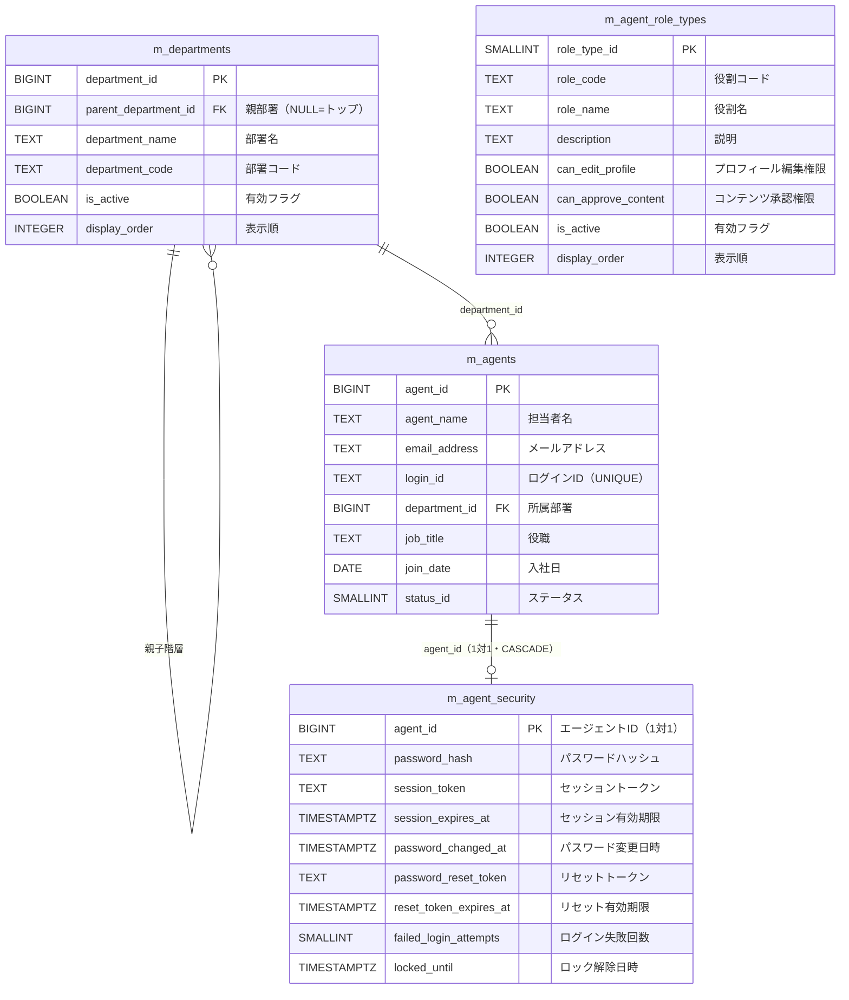

> [!NOTE]
> `m_agent_role_types` はこのドメイン図では孤立して見えますが、インフルエンサー系の `t_influencer_agent_assignments` から参照されます。

---

### 👤 インフルエンサー系

システムの中心的エンティティである `m_influencers` を起点に、認証・住所・口座・請求先・SNSアカウント・担当者割当が紐付きます。
SNSアカウントにはカテゴリ（ジャンル）が多対多で関連付けられ、`t_account_categories` が中間テーブルの役割を持ちます。

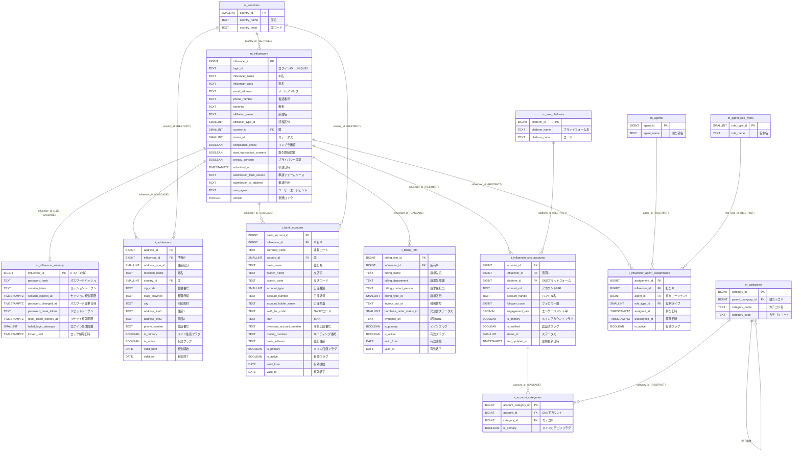

> [!NOTE]
> `m_countries`, `m_categories`, `m_sns_platforms`, `m_agent_role_types`, `m_agents` はこのドメインの参照先として簡略表示しています。完全なカラム定義は全体詳細図を参照してください。

---

### 🤝 パートナー・サイト系

パートナー企業と、そのパートナーが運営するサイトを管理するドメインです。
`m_partners` は `m_influencers` へのオプショナルFK（兼業管理）を持ちます。
`m_partners_division` はパートナーの区分情報を1対1で管理する拡張テーブルです。

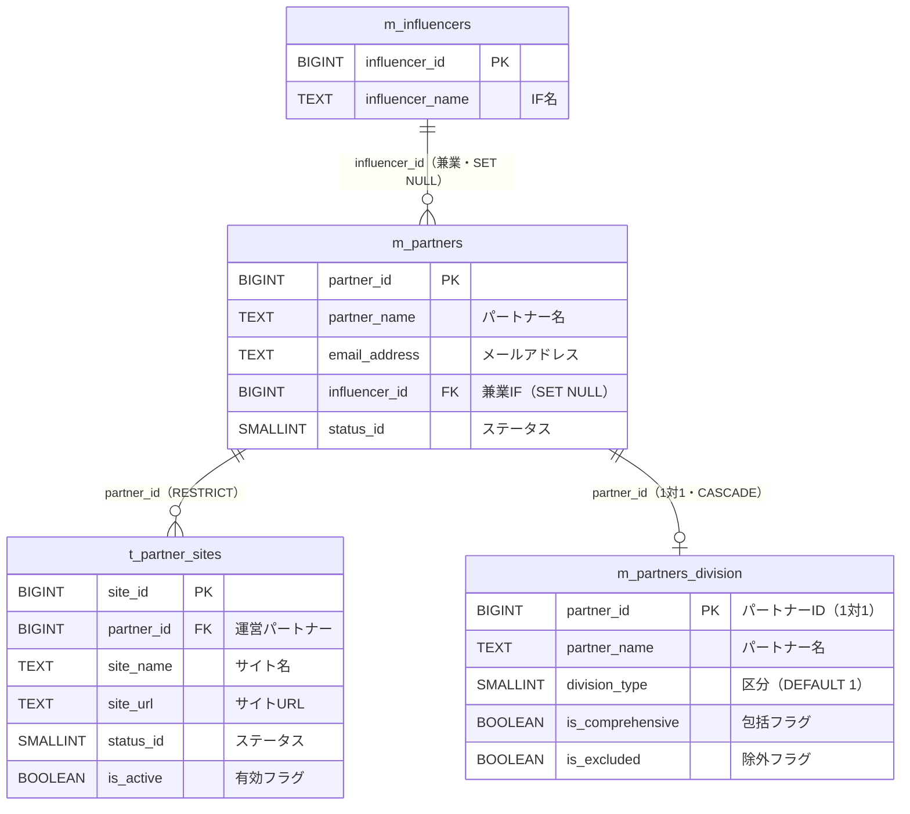

> [!NOTE]
> `m_partners` は `company_name` を持ちません。`partner_name`, `email_address`, `influencer_id`, `status_id` のみのシンプルな構造です。

---

### 📢 広告・クライアント系

クライアント（広告主）と広告グループ・広告コンテンツの管理ドメインです。
`m_ad_contents` はクライアントとエージェント（担当者）への任意参照を持ちます。

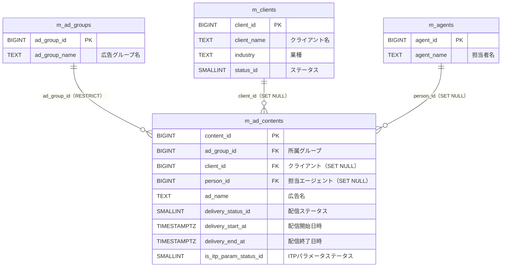

> [!NOTE]
> `m_ad_contents` のカラム名は `ad_name`（`content_name` ではない）です。`person_id` は `m_agents.agent_id` を参照します。

---

### 📊 キャンペーン・単価系

キャンペーン（加工用）と単価設定を管理するドメインです。
`m_campaigns` はパートナーサイト・インフルエンサー・SNSプラットフォームへの参照を持つシンプルな構造です。
`t_unit_prices` はサイト・広告コンテンツ・クライアントの組み合わせで単価を管理します。

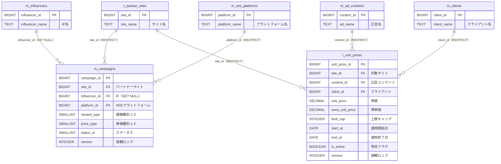

> [!IMPORTANT]
> `m_campaigns` は旧 `t_campaigns` とは全く異なるシンプルな構造です。`campaign_name` や `budget_amount` 等は持たず、`site_id`, `influencer_id`, `platform_id`, `reward_type`, `price_type`, `status_id`, `version` のみで構成されます。

---

### 📈 集計系

日次のパフォーマンスデータ（CV）とクリックデータを蓄積するドメインです。
パーティション（`RANGE(action_date)` で年単位）で管理され、FK制約でデータ整合性を担保しています。
なお `t_audit_logs` も月単位パーティション化済みです（詳細は「システム・共通機能系」セクション参照）。
スナップショット方式で名称カラムも保持し、集計時点の名称を正確に記録します。

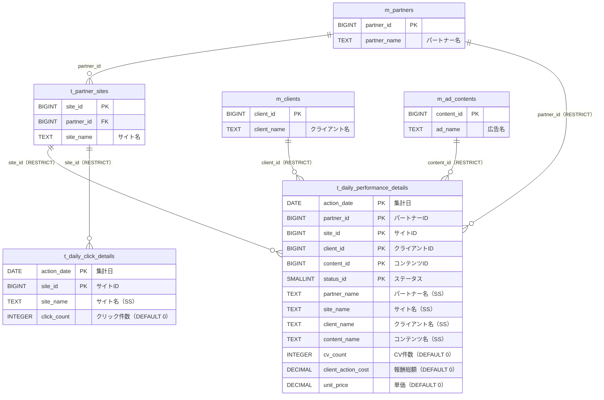

> [!TIP]
> FK制約を採用済み。設計書本体（[[ANSEM-ER図]]）に反映済みです。
> - ON DELETE RESTRICT により、参照先マスタの誤削除を防止
> - パーティションテーブルのFK制約はPostgreSQL 11以降で対応
> - スナップショットの名前カラム（partner_name等）は引き続き保持し、集計時点の名称を記録

---

### 💰 請求確定系

請求確定のスナップショットを管理するドメインです。
`t_billing_runs` は請求確定バッチ（論理削除方式）、`t_billing_line_items` は確定済みの請求明細です。
`filter_conditions`（JSONB）で確定時の抽出条件を保存し、再現性・監査に対応しています。

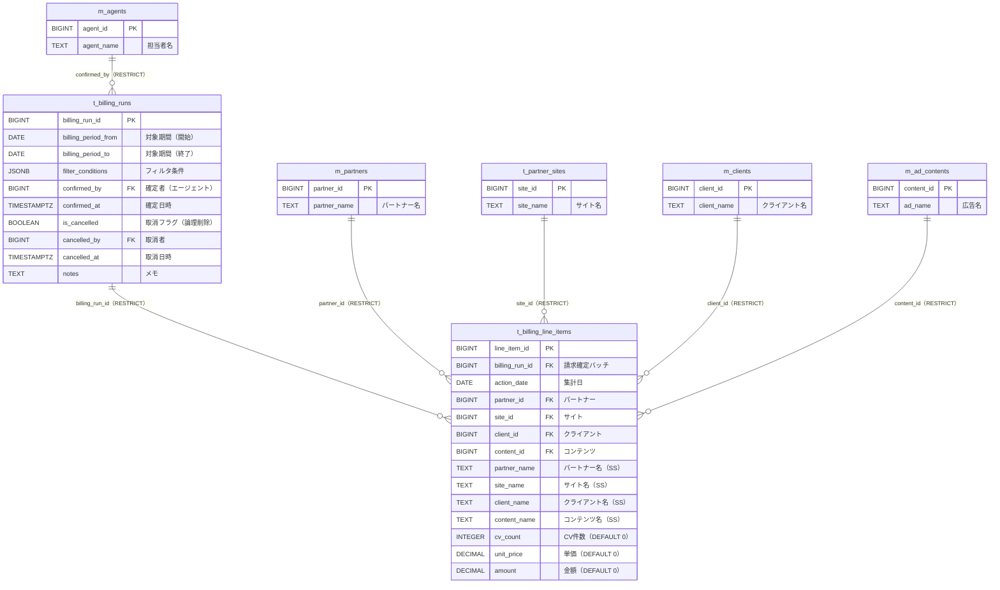

> [!IMPORTANT]
> - `t_billing_runs` は論理削除（`is_cancelled`）を採用。物理DELETEは行わない
> - CHECK制約で `is_cancelled = TRUE` のとき `cancelled_by` / `cancelled_at` が必須であることを保証
> - `filter_conditions` にはJSONBで確定時の抽出条件（partner_ids, site_ids等）を保存し、再現性を担保
> - 全FKが `ON DELETE RESTRICT` — 請求確定済みデータの参照先は削除不可
> - スナップショット名称カラムは集計テーブルと同じパターン

---

### 🔧 システム・共通機能系

ドメイン横断で使用されるシステム系テーブル群です。
`t_audit_logs`, `t_notifications`, `t_files` はポリモーフィック設計でFK制約を持ちません。
`t_translations` は多言語対応のための翻訳テーブルです。
`ingestion_logs` はBigQuery取り込みログで、監査カラムも持たない完全独立テーブルです。

```mermaid
erDiagram
    t_audit_logs {
        TIMESTAMPTZ operated_at PK "操作日時（パーティションキー）"
        BIGINT log_id PK "自動採番"
        TEXT table_name "対象テーブル名"
        BIGINT record_id "対象レコードID"
        TEXT action_type "INSERT/UPDATE/DELETE"
        JSONB old_value "変更前の値"
        JSONB new_value "変更後の値"
        SMALLINT operator_type "1:agent 2:influencer"
        BIGINT operator_id "操作者ID"
        TEXT operator_ip "操作元IP"
    }

    t_notifications {
        BIGINT notification_id PK
        BIGINT user_id "対象ユーザーID"
        SMALLINT user_type "1:agent 2:influencer 3:partner"
        TEXT notification_type "通知種別"
        TEXT title "タイトル"
        TEXT message "メッセージ"
        TEXT link_url "リンクURL"
        BOOLEAN is_read "既読フラグ"
        TIMESTAMPTZ read_at "既読日時"
    }

    t_translations {
        BIGINT translation_id PK
        TEXT table_name "対象テーブル名"
        BIGINT record_id "対象レコードID"
        TEXT column_name "対象カラム名"
        TEXT language_code "言語コード"
        TEXT translated_value "翻訳値"
    }

    t_files {
        BIGINT file_id PK
        SMALLINT entity_type "1-5:エンティティ種別"
        BIGINT entity_id "エンティティID"
        TEXT file_category "ファイルカテゴリ"
        TEXT file_name "ファイル名"
        TEXT storage_path "ストレージパス"
        TEXT mime_type "MIMEタイプ"
        BIGINT file_size_bytes "ファイルサイズ"
        SMALLINT sort_order "表示順"
        BOOLEAN is_primary "メインフラグ"
    }

    ingestion_logs {
        BIGINT ingestion_id PK
        TEXT job_type "ジョブ種別"
        TIMESTAMPTZ target_from "対象期間From"
        TIMESTAMPTZ target_to "対象期間To"
        JSONB parameters "パラメータ"
        TEXT status "RUNNING/SUCCESS/FAILED"
        INTEGER records_count "処理件数"
        TEXT error_message "エラーメッセージ"
        TIMESTAMPTZ started_at "開始日時"
        TIMESTAMPTZ finished_at "終了日時"
    }
```

> [!IMPORTANT]
> これらのテーブルはFK制約を持たないため、リレーション線はありません。
> - `t_audit_logs`: `operator_type` + `operator_id` でエージェントまたはインフルエンサーを識別（ポリモーフィック）。`PARTITION BY RANGE (operated_at)` で月次パーティション化済み。PK は `(operated_at, log_id)` の複合キー。
> - `t_notifications`: `user_type` + `user_id` でエージェント・インフルエンサー・パートナーを識別（ポリモーフィック）
> - `t_files`: `entity_type` + `entity_id` で任意エンティティを参照（ポリモーフィック）
> - `t_translations`: `table_name` + `record_id` + `column_name` + `language_code` のUNIQUE制約で一意性を担保
> - `ingestion_logs`: 監査カラム（created_by等）も持たない完全独立テーブル

---

## 補足事項

### テーブル命名規則

| プレフィックス | 意味 | 例 |
|--------------|------|-----|
| `m_` | マスタテーブル（比較的固定的なデータ） | `m_countries`, `m_agents`, `m_influencers`, `m_partners`, `m_campaigns` |
| `t_` | トランザクションテーブル（可変データ） | `t_addresses`, `t_bank_accounts`, `t_audit_logs`, `t_unit_prices` |
| プレフィックスなし | システムテーブル | `ingestion_logs` |

> [!NOTE]
> `m_influencers`, `m_partners`, `m_campaigns` はマスタ（`m_`）です。住所・口座・請求先・SNSアカウント・監査ログ等はトランザクション（`t_`）です。

### 監査カラム（全テーブル共通）

全テーブルに以下の4カラムが存在します（ER図では省略）。例外: `t_audit_logs` と `ingestion_logs` は標準の監査カラム4つを持ちません（`t_audit_logs` は `operated_at` のみ）。`m_partners_division` は `created_at`/`updated_at` のみ保持（`created_by`/`updated_by` なし）。

| カラム | 型 | 説明 |
|-------|-----|------|
| `created_by` | BIGINT | 作成者ID |
| `updated_by` | BIGINT | 更新者ID |
| `created_at` | TIMESTAMPTZ | 作成日時 |
| `updated_at` | TIMESTAMPTZ | 更新日時 |

### ポリモーフィックテーブル

以下のテーブルはFK制約を持たず、型識別カラム + IDカラムの組み合わせで参照先を動的に決定します。

| テーブル | 型識別カラム | IDカラム | 参照先 |
|---------|------------|---------|--------|
| `t_audit_logs` | `operator_type` (1,2) | `operator_id` | m_agents / m_influencers |
| `t_notifications` | `user_type` (1,2,3) | `user_id` | m_agents / m_influencers / m_partners |
| `t_files` | `entity_type` (1-5) | `entity_id` | 複数エンティティ |
| `t_translations` | `table_name` | `record_id` | 任意テーブル |

### 楽観ロック

以下のテーブルは `version` カラムを持ち、楽観的ロック制御に使用します。

| テーブル | 用途 |
|---------|------|
| `m_influencers` | IFプロフィールの同時更新防止 |
| `m_campaigns` | キャンペーン設定の同時更新防止 |
| `t_unit_prices` | 単価設定の同時更新防止 |

### ON DELETE ポリシー

| ポリシー | 適用場面 | 例 |
|---------|---------|-----|
| RESTRICT | 原則（参照先の削除を防止） | `t_partner_sites → m_partners` |
| CASCADE | IF従属データ・1対1セキュリティ | `t_addresses → m_influencers`, `m_agent_security → m_agents` |
| SET NULL | 任意参照（NULLで代替可能） | `m_partners → m_influencers`, `m_ad_contents → m_clients` |
