# BQ → Cloud SQL データ連携 設計案

## 背景・前提

- ANSEMのCVとClickデータが**他部署BQ**にリアルタイムで蓄積されている
- IF-DB の Cloud SQL に日次データとして流し込む必要がある
- ANSEM API 直接叩きはレート制限で現実的でない
- **他部署への向付請求を発生させたくない**

---

## 採用案：クロスプロジェクト BQ クエリ

### 全体アーキテクチャ


---

## 課金の仕組み


> [!IMPORTANT]
> **クローンではない。** SELECT した結果を直接 Cloud SQL に INSERT するだけ。
> 他部署BQにデータのコピーは作られない。

---

## 他部署にお願いすること（1回だけ）


> [!NOTE]
> お金の話ではなく**アクセス許可の話**。一度設定したら以後は不要。

---

## 調理（変換処理）の場所


> [!TIP]
> Cloud SQL 側にビジネスロジックを持たせない。
> Pythonで管理 → Git管理・テスト・デバッグがしやすい。

---

## バッチ設計

```mermaid
gantt
    title 1日のバッチスケジュール
    dateFormat HH:mm
    axisFormat %H:%M

    section ANSEM
    前日データがBQに確定  : done, 00:00, 07:00

    section IF-DB
    Cloud Scheduler 起動  : milestone, 08:00, 0m
    BQクエリ実行          : active, 08:00, 08:05
    調理・Cloud SQL upsert: active, 08:05, 08:10
    Slack通知（完了）      : milestone, 08:10, 0m
```



- **実行頻度**: 1日1回（毎朝8時）
- **対象データ**: 前日分
- **0件検知**: BQの問題があれば Slack に自動通知

---

## スキャン料金について

> [!NOTE]
> BQの課金は「クエリジョブを実行したプロジェクト」に発生する。
> `bigquery.Client(project="if-db-project")` で投げれば **他部署への課金ゼロ**。

### コスト試算


| 条件 | スキャン量 | 費用 |
|------|----------|------|
| 1日 100MB × 30日 | 3GB/月 | **$0（無料枠内）** |
| 1日 1GB × 30日 | 30GB/月 | **$0（無料枠内）** |
| 無料枠超過後 | 1TB あたり | $5 |

### スキャン量を最小化する方法

パーティションフィルタを必ず使う：

```python
# WHERE action_date = @target_date を必ず指定
# → その日の分だけスキャン（テーブル全体をスキャンしない）
query = """
    SELECT action_date, partner_id, site_id, cv_count
    FROM `other-project.ansem_dataset.cv_raw`
    WHERE action_date = @target_date  -- ← ここが重要
"""
```


### 会議前に確認すること（スキャン料金）

> [!WARNING]
> **他部署BQのテーブルが `action_date` でパーティション分割されているか確認する**
> されていない場合 → 他部署に対応を依頼する

---

## 他部署への課金：例外ケース

通常はゼロだが、**1つだけ例外がある**。

| 料金体系 | 他部署への課金 |
|---------|-------------|
| オンデマンド（従量課金） | **ゼロ** ✅ |
| ストレージ料金 | 元々払ってるもの。増えない ✅ |
| スロット予約（定額課金） | **要確認** ⚠️ |

### スロット予約とは


> [!NOTE]
> スロット予約は大量データを扱う大企業が採用するケースが多い。
> 小〜中規模であればオンデマンドがほぼ確実。

---

## 会議で確認したいこと

- [ ] **他部署BQの料金プランはオンデマンド？スロット予約？**（課金ゼロの確認）
- [ ] 他部署BQのテーブルが `action_date` でパーティション分割されているか
- [ ] 他部署のBQへの書き込みが何時頃に完了するか（実行時間の確定）
- [ ] 他部署に権限付与を依頼できるか
- [ ] 対象テーブル名・プロジェクト名の確認

---

## 残課題

- セミアフィ判定の詳細ロジック
- バリデーションエラー時のリカバリ設計
- 調理ロジックの詳細設計

---

作成日: 2026-02-25
作成者: sekiguchi
