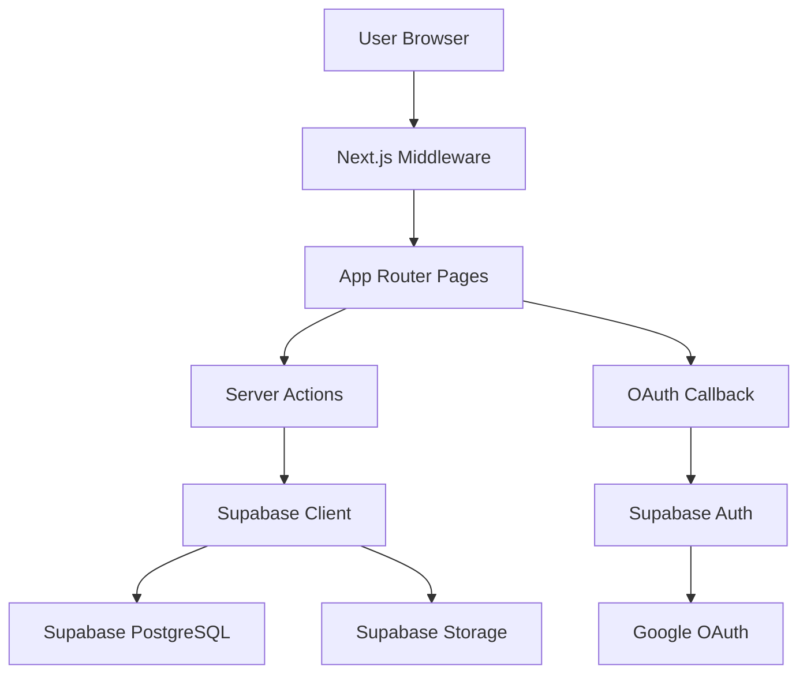

# Security Threat Model — Reference

脅威モデリングスキルで使う STRIDE カテゴリ、テンプレート、攻撃ベクター一覧、実例のリファレンス集。
詳細なプロンプトテンプレートと出力契約は `references/prompt-template.md` を参照。

---

## Quick Reference

- Anchor claims to **repo evidence**, not generic checklists
- Validate assumptions with user **before** finalizing
- Output: `<repo-name>-threat-model.md`
- Risk = Likelihood x Impact（既存コントロールで調整）

---

## STRIDE Threat Categories

各カテゴリの定義、典型的な攻撃例、検出のヒント。

| カテゴリ | 定義 | 攻撃例 | 検出ポイント |
|----------|------|--------|-------------|
| **S**poofing（なりすまし） | 他者のIDを偽装してアクセス | セッション乗っ取り、JWT偽造、OAuthリダイレクト改ざん | 認証ロジック、トークン検証、セッション管理 |
| **T**ampering（改ざん） | データや設定を不正に変更 | SQLインジェクション、リクエストボディ改ざん、設定ファイル書き換え | 入力バリデーション、DB操作、ファイル書き込み |
| **R**epudiation（否認） | 行為の痕跡を消す/否定する | 監査ログの削除、ログインジェクション、タイムスタンプ改ざん | ログ出力、監査証跡、ログの完全性保護 |
| **I**nformation Disclosure（情報漏洩） | 機密情報の意図しない露出 | エラーメッセージにスタックトレース、APIレスポンスに余分なフィールド、.env漏洩 | エラーハンドリング、APIレスポンス、静的ファイル |
| **D**enial of Service（サービス拒否） | サービスの可用性を妨害 | レート制限なしのエンドポイント、巨大ファイルアップロード、ReDoS | レート制限、入力サイズ制限、正規表現 |
| **E**levation of Privilege（権限昇格） | より高い権限を不正に取得 | IDOR（他ユーザーのリソースアクセス）、RLS バイパス、管理者API直接呼び出し | 認可チェック、RLS ポリシー、ロールベースアクセス |

### STRIDE の適用手順

```
1. コンポーネント/データフローを1つ選ぶ
2. 6カテゴリそれぞれで「この脅威は当てはまるか？」を問う
3. 当てはまるものだけ深掘りして abuse path を記述
4. 全コンポーネント/データフローに繰り返す
```

---

## Threat Model Template

脅威モデルドキュメントの構造テンプレート。`references/prompt-template.md` の Required output format に準拠。

```markdown
# Threat Model: [リポジトリ名/サービス名]

## Executive Summary
[最大リスクテーマと最も危険な領域を1段落で記述]

## Scope and Assumptions
- **In-scope**: [対象パス/コンポーネント]
- **Out-of-scope**: [除外対象]
- **Assumptions**:
  - [仮定1: 例 — インターネット公開されたWebアプリケーション]
  - [仮定2: 例 — 認証済みユーザーのみがAPIにアクセス]
- **Open Questions**:
  - [未確認事項1]

## System Model

### Primary Components
| コンポーネント | 種別 | 役割 | Evidence |
|---------------|------|------|----------|
| [名前] | [Web/API/DB/Worker] | [説明] | `path/to/file` |

### Data Flows and Trust Boundaries
- Internet → Next.js Frontend: HTML/JS, HTTPS, 認証なし（公開ページ）
- Frontend → API Route: JSON, HTTPS, JWT Bearer token, Zod validation
- API Route → Supabase: SQL, TLS, service_role key, RLS enforced
- [追記...]

### Diagram
` ` `mermaid
flowchart TD
    User["User Browser"] --> Frontend["Next.js Frontend"]
    Frontend --> API["API Routes"]
    API --> DB["Supabase PostgreSQL"]
    API --> Storage["Supabase Storage"]
    API --> External["External API"]
` ` `

## Assets and Security Objectives
| Asset | Why it matters | Objective (C/I/A) |
|-------|---------------|-------------------|
| ユーザー認証情報 | アカウント乗っ取りリスク | C, I |
| 個人データ（PII） | プライバシー侵害、法的リスク | C |
| セッショントークン | なりすましアクセス | C, I |
| DBアクセス権限 | データ全体の漏洩/改ざん | C, I, A |

## Attacker Model
### Capabilities
- [例: インターネット経由の未認証アクセス]
- [例: 認証済みユーザーとしての操作]

### Non-capabilities
- [例: サーバーへの物理アクセスは不可]
- [例: Supabase インフラへの直接アクセスは不可]

## Entry Points and Attack Surfaces
| Surface | How reached | Trust boundary | Notes | Evidence |
|---------|------------|---------------|-------|----------|
| [名前] | [経路] | [境界] | [備考] | `path` |

## Top Abuse Paths
1. **[攻撃目標]**: [Step1] → [Step2] → [Step3] → [Impact]
2. ...

## Threat Model Table
| ID | Source | Prerequisites | Action | Impact | Assets | Controls | Gaps | Mitigations | Detection | L | I | Priority |
|----|--------|--------------|--------|--------|--------|----------|------|-------------|-----------|---|---|----------|
| TM-001 | [誰] | [前提] | [行為] | [影響] | [資産] | [既存] | [不足] | [推奨] | [検知] | H | H | critical |

## Focus Paths for Security Review
| Path | Why it matters | Related Threat IDs |
|------|---------------|-------------------|
| `path/to/file` | [理由] | TM-001, TM-003 |
```

---

## Common Attack Vectors by Application Type

### Web Application（Next.js）

| 攻撃ベクター | 対象 | 典型的な手法 | 主な対策 |
|-------------|------|------------|---------|
| XSS | クライアントサイドレンダリング | `dangerouslySetInnerHTML`、未サニタイズのユーザー入力 | React の自動エスケープ活用、CSP ヘッダー |
| CSRF | Server Actions / API Routes | セッション付きの状態変更リクエスト偽造 | SameSite Cookie、Origin チェック、CSRF トークン |
| SSRF | Server Components / Route Handlers | ユーザー入力URLの fetch | URL allowlist、プライベートIPブロック |
| SQLi | DB クエリ | 文字列結合によるクエリ構築 | パラメータ化クエリ（Supabase SDK 利用） |
| IDOR | API エンドポイント | 他ユーザーの resource ID を直接指定 | RLS ポリシー、認可チェック |
| Path Traversal | ファイル操作 | `../` を含むファイルパス | パス正規化、allowlist |
| Open Redirect | OAuth / ログインフロー | リダイレクトURL改ざん | URL allowlist、相対パスのみ許可 |
| Prototype Pollution | サーバーサイド JS | `__proto__` / `constructor` 経由のオブジェクト汚染 | Object.create(null)、入力バリデーション |

### API（Route Handlers / Server Actions）

| 攻撃ベクター | リスク | 対策 |
|-------------|--------|------|
| 認証バイパス | 未認証でのAPI呼び出し | middleware での認証チェック必須化 |
| Mass Assignment | 想定外のフィールド更新 | Zod スキーマで許可フィールドを明示 |
| Rate Limit 未設定 | DoS / ブルートフォース | Upstash Ratelimit / Vercel WAF |
| エラー情報漏洩 | 内部構造の露出 | 本番ではジェネリックエラーメッセージ |
| JWT 検証不備 | トークン偽造 | `supabase.auth.getUser()` でサーバーサイド検証 |

### Supabase 固有

| 攻撃ベクター | リスク | 対策 |
|-------------|--------|------|
| RLS 未設定/不備 | テーブル全データ漏洩 | 全テーブルに RLS 必須、`auth.uid()` ベースのポリシー |
| `service_role` key 漏洩 | RLS バイパスで全データアクセス | サーバーサイドのみ使用、クライアントに露出させない |
| `anon` key の過信 | 公開テーブルへの書き込み | `anon` 経由のアクセスは RLS で厳密に制御 |
| Storage ポリシー不備 | ファイルの不正アクセス/上書き | バケットごとにアクセスポリシー設定 |
| Edge Functions の認証 | 未認証呼び出し | `Authorization` ヘッダー検証 |
| Realtime のチャネル漏洩 | 他ユーザーの更新を傍受 | RLS 連動のチャネル設定 |

---

## Example: Next.js + Supabase App Threat Model（抜粋）

実際のプロジェクトに近い脅威モデルの例。

### System Model



### Top Abuse Paths

| # | Goal | Path | Impact | Priority |
|---|------|------|--------|----------|
| 1 | 他ユーザーのデータ閲覧 | IDOR: `/api/users/[id]` に他者IDを指定 → RLS が不十分なテーブルでデータ取得 | PII漏洩 | **high** |
| 2 | 管理者権限の取得 | JWT の `role` クレームを改ざん → サーバーサイドで `getUser()` ではなく `getSession()` で検証 → 権限昇格 | 全データアクセス | **critical** |
| 3 | service_role key の窃取 | クライアントバンドルに key が混入 → ブラウザ DevTools で抽出 → RLS バイパス | 全データアクセス | **critical** |
| 4 | XSS による セッション窃取 | ユーザー投稿コンテンツの未サニタイズ → `httpOnly` でない Cookie 窃取 | アカウント乗っ取り | **high** |
| 5 | SSRF | Server Action 内でユーザー指定URLを fetch → 内部ネットワークへアクセス | 内部サービス露出 | **medium** |

### Threat Table（抜粋）

| ID | Source | Action | Impact | Existing Controls | Gaps | Mitigation | L | I | Priority |
|----|--------|--------|--------|-------------------|------|------------|---|---|----------|
| TM-001 | 認証済みユーザー | 他者IDで API 呼び出し | PII漏洩 | RLS (部分的) | 一部テーブルで RLS 未設定 | 全テーブルに `auth.uid()` ベースの RLS 追加 | M | H | high |
| TM-002 | 未認証攻撃者 | JWT role クレーム改ざん | 権限昇格 | Supabase Auth | `getSession()` はクライアント由来で信頼不可 | `getUser()` に統一 | M | H | critical |
| TM-003 | 未認証攻撃者 | バンドル内の service_role key 抽出 | 全データアクセス | なし | env 変数の使い分けミス | `NEXT_PUBLIC_` に service_role を設定しない。CI で検出 | H | H | critical |
| TM-004 | 認証済みユーザー | UGC 経由の XSS | セッション窃取 | React 自動エスケープ | `dangerouslySetInnerHTML` の使用箇所 | CSP 設定、DOMPurify でサニタイズ | M | H | high |
| TM-005 | 認証済みユーザー | Server Action で SSRF | 内部サービス露出 | なし | ユーザー入力URLの検証なし | URL allowlist + プライベートIP拒否 | L | M | medium |

### Focus Paths

| Path | Reason | Related |
|------|--------|---------|
| `app/api/**` | 全 API Route の認証・認可チェック | TM-001, TM-002 |
| `lib/supabase/` | クライアント初期化、key の取り扱い | TM-003 |
| `components/**/` | `dangerouslySetInnerHTML` の有無 | TM-004 |
| `app/**/actions.ts` | Server Actions 内の fetch / DB操作 | TM-001, TM-005 |
| `middleware.ts` | 認証ガードの網羅性 | TM-001, TM-002 |
| `supabase/migrations/` | RLS ポリシーの設定状況 | TM-001 |

---

## Risk Prioritization Guide

SKILL.md の基準を具体例付きで整理。

| Priority | 基準 | 具体例 |
|----------|------|--------|
| **Critical** | 認証不要で高影響 | Pre-auth RCE、認証バイパス、service_role key 漏洩、クロステナントアクセス |
| **High** | 認証後 or 条件付きで高影響 | IDOR による PII 漏洩、XSS によるセッション窃取、JWT 検証不備、RLS 不備 |
| **Medium** | 限定的な影響 or 前提条件あり | ターゲット DoS、部分的データ露出、レート制限バイパス、ログ汚染 |
| **Low** | 影響小 or 前提条件が非現実的 | 低感度の情報漏洩、緩和容易な DoS、発生確率が極めて低い攻撃 |

### Likelihood x Impact マトリクス

```
             Impact
             Low    Medium   High
Likelihood
  High       medium  high    critical
  Medium     low     medium  high
  Low        low     low     medium
```

---

## Quality Checklist（最終確認）

レポート完成前に確認する項目。SKILL.md Step 8 に対応。

- [ ] 発見した全エントリーポイントがカバーされている
- [ ] 各 trust boundary が少なくとも1つの threat に反映されている
- [ ] runtime vs CI/dev/test の分離が明確
- [ ] ユーザーへの確認事項が反映されている（未回答は明示）
- [ ] 仮定（assumptions）とオープンクエスチョンが明示されている
- [ ] `references/prompt-template.md` の出力フォーマットに準拠している
- [ ] 全ての architectural claim にエビデンスアンカー（repo path）がある
- [ ] 機密情報（トークン、キー、パスワード）が出力に含まれていない
- [ ] Mermaid 図がレンダリング可能か（`flowchart TD/LR`、`-->` のみ）
- [ ] Threat ID が `TM-001` 形式で連番になっている

---

## Cross-references

| 関連リソース | 用途 |
|-------------|------|
| `references/prompt-template.md` | 出力契約とプロンプトテンプレート（詳細版） |
| `references/security-controls-and-assets.md` | セキュリティコントロールと資産カテゴリのチェックリスト |
| `security-review` スキル | コードレベルの脆弱性検出 |
| `security-best-practices` スキル | セキュアコーディングパターンの適用 |
| `security-arsenal` スキル | Red/Blue チームのオペレーション実行 |
